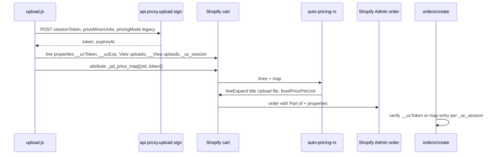

# Admin order detail — Upload Center parity

**Target (merchant-visible on Shopify Admin → Orders → line item):**

```
__View uploads: your-store.myshopify.com...
Part of: Upload file
View uploads: https://your-store.myshopify.com/apps/printdock/f/AbC12dEf34
__ucExp: 1779225656
__ucToken: eyJhbGciOiJIUzI1NiJ9...
```

Reference competitor row (Build A, single line, `lineExpand`, no fee product): `silverbeauty-2.myshopify.com` / Upload Center `/a/upload-center/uploads/{session}/File`.

---

## Goals

| Goal | Notes |
|------|--------|
| **Clickable truncated link** | First row `__View uploads: {shop}...` behaves like competitor (Admin linkifies value). |
| **Full download URL** | `View uploads:` holds bare `https://…` app-proxy short link (permanent `/apps/printdock/f/{id}`). |
| **Part of: Upload file** | From Cart Transform `lineExpand.title` on Build A (today title is `None` → Part of shows product title). |
| **Pricing on line** | `__ucToken` + `__ucExp` on the line for parity and webhook audit; **keep** cart `_pd_price_map` for WASM (no regressions). |
| **No fee product** | Stays Build A (already shipped v1.0.8). |

## Non-goals

- Copying Upload Center’s JWT claim names (`clid`, `fid`, `t`) — keep PrintDock `shop`, `sid`, `p`, `c`, `exp`, `iat` inside `__ucToken`.
- Replacing short links with long session paths (`/uploads/{uuid}/File`) unless spike proves Admin only linkifies that shape.
- Re-introducing Build B second line or hidden fee product.

---

## Current vs target

| Competitor (observed) | PrintDock today (v1.0.8) | Target |
|----------------------|---------------------------|--------|
| `__View uploads: shop...` (clickable) | `View uploads` + `Print Ready File` (same short URL) | Add **`__View uploads`**; keep **`View uploads`** full URL |
| `Part of: Upload file` | `Part of: {product title}` | **`lineExpand.title`** = `"Upload file"` or field title |
| `View uploads: https://…/File` | Short `/apps/printdock/f/…` | **Unchanged URL strategy** (shorter, same behavior) |
| `__ucExp` / `__ucToken` on line | Token only in order note `_pd_price_map` | **Dual-write** token on line + map |
| No visible session UUID | `_uc_session`, `Artwork` visible | Keep **`_uc_session`** (webhook/ingest); keep **`Artwork`** optional |

---

## Architecture



**Trust model (unchanged):** Cart Transform reads `_pd_price_map` + `_uc_session`. Line `__ucToken` is a **copy** for Admin + order webhook fallback, not a second source of truth unless map is missing.

---

## Phase 0 — Spike (mandatory, ~2h)

**File:** `docs/SPIKE_ADMIN_ORDER_LINE_PROPERTIES.md`

On a dev store with dynamic pricing enabled, add one line with test properties and place a Bogus Gateway order. Record screenshots + GraphQL `order.lineItems.customAttributes`.

| Test property key | Test value | Question |
|-------------------|------------|----------|
| `__View uploads` | Full short URL `https://{shop}/apps/printdock/f/{id}` | Does Admin show `shop...` truncated **and** linkify? |
| `__View uploads` | `https://{shop}.myshopify.com` only | Clickable but wrong target — reject unless full URL fails |
| `View uploads` | Full short URL | Full URL clickable on Part of line? |
| `_View uploads` | Full short URL | Legacy key; linkify? |

**Exit criteria:** Document the exact key/value pair that produces competitor-style `shop.myshopify.com...` clickable row. If only full URL works, set **`__View uploads` = same string as `View uploads`** (Admin truncation is cosmetic).

---

## Phase 1 — Line item property contract

**Update:** [`docs/MERCHANT_FIELDS.md`](docs/MERCHANT_FIELDS.md)

**Write on cart add** ([`extensions/theme-extension/assets/upload.js`](extensions/theme-extension/assets/upload.js) `getCartProperties` + `appendSignedPriceTokenToLinePropertiesAsync`):

| Key | Value | Visible to customer at checkout? | Purpose |
|-----|--------|----------------------------------|---------|
| `_uc_session` | UUID | Hidden (`_` prefix) | Webhook, ingest, support |
| `Artwork` | `file.png` | Yes | Human-readable file name |
| `__View uploads` | Short URL (see spike) | Hidden (`__`) | Admin truncated link row |
| `View uploads` | Same short URL, bare `https://` | Yes | Full clickable download |
| `__ucExp` | Unix string from sign response | Hidden | Parity + support |
| `__ucToken` | JWT from [`signPriceToken`](app/services/price-token.server.ts) | Hidden | Parity + webhook fallback |
| `Print Ready File` | *(optional)* | Yes | **Deprecate on new orders** — keep reading in ingest/extension for old orders only |

**Rules:**

- Values for URL keys: **only** the URL string (no `View uploads: ` inside value — that prefix is Admin’s label).
- Use [`normalizePrintReadyUrlForCartProperty`](extensions/theme-extension/assets/upload.js) / [`buildPrintReadyFileUrl`](app/services/short-link.server.ts) for both upload keys.
- After sign succeeds, set `__ucExp` = `String(expiresAt)` and `__ucToken` = token; still call `upsertCartPriceMapForSessionAsync`.

**Remove from theme cart add (new orders):** duplicate-only noise if spike confirms `View uploads` is enough — e.g. stop writing `Print Ready File` on new adds (ingest already falls back to `View uploads`).

---

## Phase 2 — `Part of: Upload file`

**File:** [`extensions/auto-pricing-rs/src/main.rs`](extensions/auto-pricing-rs/src/main.rs)

Today Build A sets `expand_title: None` (lines 157–161), so Shopify shows **Part of: {product title}**.

```rust
// Build A only (when !uses_fee_lines)
let expand_title = Some(
    storefront_title_from_config
        .unwrap_or_else(|| "Upload file".to_string())
);
```

**Config source options (pick one in implementation):**

1. **Constant** `"Upload file"` — matches competitor literally; zero config surface.
2. **Cart line attribute** `_pd_part_of_title` set by theme from `fieldConfig.storefrontTitle` — matches merchant wording.

**Fixture:** Update [`extensions/auto-pricing-rs/tests/fixtures/legacy-session-valid.json`](extensions/auto-pricing-rs/tests/fixtures/legacy-session-valid.json) `output.operations[0].lineExpand.title` if asserting title in tests.

**Deploy:** `shopify app deploy` (function + theme).

---

## Phase 3 — Webhook & ingest

**Files:**

- [`app/routes/webhooks.orders.create.tsx`](app/routes/webhooks.orders.create.tsx)
- [`app/services/order-ingest.server.ts`](app/services/order-ingest.server.ts) `buildPricingEvidence`

**Change:** Resolve price token per session:

```ts
const fromLine = props.find(p => p.name === "__ucToken")?.value;
const fromMap = signedPriceMapBySession[sessionToken];
const priceTokenRaw = fromLine || fromMap;
```

Verify with existing `verifyPriceToken`. Prefer line token when both present and both valid; log `pricing_token_map_mismatch` if signatures disagree.

**Hint scanner:** Extend `hasPrintDockHints` to include `__View uploads`, `View uploads`.

**Do not** remove `_pd_price_map` from cart — Cart Transform still requires it.

---

## Phase 4 — Admin extension & app job UI

**File:** [`extensions/printdock-order-files/src/ActionExtension.jsx`](extensions/printdock-order-files/src/ActionExtension.jsx)

- Add `__View uploads`, `_View uploads` to `PRINT_READY_FILE_KEYS` (or rename set to `DOWNLOAD_URL_KEYS`).
- Prefer **`View uploads`** for download button; `__View uploads` as fallback.

**File:** [`app/services/order-ingest.server.ts`](app/services/order-ingest.server.ts)

- Already reads `View uploads`; add `__View uploads` in `resolveAssetsFromLine` chain.

**PrintDock app job page** ([`app/routes/app.orders.$id.tsx`](app/routes/app.orders.$id.tsx)): No change required for parity (ops UI stays as-is). Optional later: show parsed `__ucExp` / token valid badge.

---

## Phase 5 — Cart validation (optional hardening)

**File:** [`extensions/cart-fee-validation/src/cart_validations_generate_run.rs`](extensions/cart-fee-validation/src/cart_validations_generate_run.rs)

If dynamic pricing enabled and line has `_uc_session` + pricing enabled field:

- When `__ucToken` present, verify HMAC (same as transform).
- When missing `__ucToken` but map has token → pass (backward compat).
- Do **not** block solely for missing `__ucToken` until theme rollout is complete.

---

## Example — PrintDock order line (after implementation)

**Shopify Admin → Order #1042 → line item (Build A, dynamic pricing on):**

```
Custom poster — Large / Matte                         $24.99
  Part of: Upload file

  __View uploads
  https://silverbeauty-2.myshopify.com/apps/printdock/f/xY9zQ2aB1c

  View uploads
  https://silverbeauty-2.myshopify.com/apps/printdock/f/xY9zQ2aB1c

  __ucExp
  1779225656

  __ucToken
  eyJhbGciOiJIUzI1NiJ9.eyJzaG9wIjoic2lsdmVyYmVhdX...

  Artwork
  logo-front.png

  _uc_session
  10a72f63-7157-4f4c-913f-fbec58e3a578
```

*(Admin may render `__View uploads` value as `silverbeauty-2.myshopify.com...` with the full href behind it — confirm in Phase 0.)*

**Order → Additional details:**

```
_pd_price_map: [{"sid":"10a72f63-...","token":"eyJ..."}]
```

---

## QA matrix

| Case | Expected |
|------|----------|
| New order, dynamic pricing on | One line; Part of **Upload file**; both upload URLs work; price = base + fee |
| Click `__View uploads` | Downloads file (or opens proxy → 302 attachment) |
| Click `View uploads` | Same |
| Order webhook | Job created; `pricingEvidence.tokenValid` true |
| Map stripped, `__ucToken` on line | Ingest still validates price |
| Legacy order with `Print Ready File` only | Ingest + PrintDock files action still work |
| Legacy Build B two-line cart | Unchanged; fee-line transform path |
| Checkout customer view | `__*` properties hidden; `Artwork` + `View uploads` visible per Shopify rules |

---

## Rollout

1. Ship theme + function + app (no merchant setup).
2. Release note in [`app/data/release-notes.ts`](app/data/release-notes.ts) — “Order lines match standard upload-app layout”.
3. No migration for old orders; read paths stay backward compatible.

---

## Risk register

| Risk | Mitigation |
|------|------------|
| Admin does not linkify `__View uploads` | Spike first; fallback **More actions → PrintDock files** |
| Property size limits | Short URL ~60 chars; JWT ~200 chars — within Shopify limits |
| Token on line + map drift | Webhook prefers line; log mismatch |
| `lineExpand.title` rejected by API | Fall back to product title; document in spike |
| Customer sees `__ucToken` | Keys use `__` / `_` hiding rules; verify on checkout |

---

## File checklist

| Area | Files |
|------|--------|
| Theme | `extensions/theme-extension/assets/upload.js` |
| Sign API | `app/routes/api.proxy.upload.sign.tsx` (no change if theme writes exp from response) |
| Cart Transform | `extensions/auto-pricing-rs/src/main.rs`, fixtures |
| Webhook / ingest | `webhooks.orders.create.tsx`, `order-ingest.server.ts` |
| Admin action | `extensions/printdock-order-files/src/ActionExtension.jsx` |
| Docs | `MERCHANT_FIELDS.md`, `PRINT_READY_FILE_SHORT_LINKS.md`, `MERCHANT_GUIDE.md` |
| Spike | `docs/SPIKE_ADMIN_ORDER_LINE_PROPERTIES.md` (new) |
