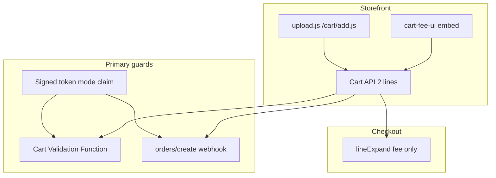

# Build B cart drawer merge and fee guards

**Status:** Revised with corrections C1–C9 (apply before implementation).

## Goals (unchanged architecture)

- **Keep** two cart lines server-side (artwork + fee variant), Cart Transform `lineExpand` on **fee line only** ([`extensions/auto-pricing-rs/src/main.rs`](extensions/auto-pricing-rs/src/main.rs)).
- **Do not** reprice/expand the artwork line (preserves clickable `Print Ready File` in Admin per [`docs/PRINT_READY_FILE_SHORT_LINKS.md`](docs/PRINT_READY_FILE_SHORT_LINKS.md)).
- **Fix storefront UX:** cart drawer shows **one logical row** with transparent fee disclosure; fee line not independently removable/qty-editable when embed is enabled.
- **Close exploit (priority):** Build B already ships — fee-skip is live. Server guards are **primary** protection; embed is secondary UX.

## Non-goals

- Hiding the fee from subtotal (opaque pricing).
- Merging lines at checkout (Shopify-hosted; two lines remain — acceptable).
- Replacing Build B with single-line expand on the product.
- Using Cart Validation Function **`fetch` target** (Enterprise/custom-app only — breaks non-Plus market).

---

## C1 — Mode claim in signed token (prerequisite for §3 and §4)

**Problem:** Legacy single-line mode has **no fee line** but still writes `_pd_price_map` (transform needs the token on the artwork line). Blocking/flagging on “session in price map” alone **false-positives every legacy checkout/order**.

**Fix:**

- Add optional JWT claim `mode`: `"buildB"` | `"legacy"` in:
  - [`app/services/price-token.server.ts`](app/services/price-token.server.ts) (`PriceTokenPayload`, sign/verify)
  - [`app/routes/api.proxy.upload.sign.tsx`](app/routes/api.proxy.upload.sign.tsx) / [`extensions/theme-extension/assets/upload.js`](extensions/theme-extension/assets/upload.js) (`useFeeLine` → `buildB`, else `legacy`)
  - [`extensions/auto-pricing-rs/src/main.rs`](extensions/auto-pricing-rs/src/main.rs) (`TokenPayload` deserialize; ignore unknown fields)
- **Validation function:** emit blocking error **only** when HMAC verifies and `mode === "buildB"` **and** no matching fee line (`_pd_fee_for` = `sid`, qty match). Never block on cart shape alone.
- **Webhook:** set `pricingEvidence.anomalyReason = "upload_fee_line_missing"` **only** on that same condition.
- **Backward compatibility:** token with **no** `mode` claim → **do not block**, **do not flag**. Prefer missing a brief exploit window over blocking real checkouts during TTL transition.

**Tests:** [`tests/price-token.test.ts`](tests/price-token.test.ts) for sign/verify with `mode`; validation fixtures for legacy + missing `mode`.

---

## C8 — Fee display title at expand (todo: `transform-fee-title`)

**File:** [`extensions/auto-pricing-rs/src/main.rs`](extensions/auto-pricing-rs/src/main.rs)

- When `uses_fee_lines`, set shopper-facing title to **"Artwork upload fee"**.
- **Verify at implementation** against generated Rust types: user correction targets `ExpandedItem.title`; current GraphQL [`schema.graphql`](extensions/auto-pricing-rs/schema.graphql) exposes `title` on `LineExpandOperation` (line ~3755), not on `ExpandedItem`. Use whichever field the generated `schema::ExpandedItem` / `LineExpandOperation` actually supports after `cargo build`.
- Legacy path: no title override.
- Update fixtures + [`tests/cart-transform-rs.test.ts`](tests/cart-transform-rs.test.ts).

---

## C7 — Cart Checkout Validation Function (todo: `cart-validation-fn`)

**New extension:** `extensions/cart-fee-validation-rs/` (mirror auto-pricing-rs layout)

- **Target:** `cart.validations.generate.run` only — **no `fetch` target**.
- **Self-contained:** cart line properties + verified price-map tokens (read shop HMAC metafield like transform). Properties-only pairing rules still apply for fee↔artwork symmetry.
- **Blocking rule (Build B only):** per C1, after verify token for `sid`, if `mode === "buildB"` and no fee line with `_pd_fee_for === sid` (and qty match) → validation error.
- **Symmetric non-blocking checks** (always): orphan fee line without artwork; qty mismatch — can be errors or warnings per fixture design.
- **Shopper message:** clear, non-destructive where possible; validation block is last resort when self-heal (C6) cannot run.

**App wiring:**

- [`app/services/cart-validation.server.ts`](app/services/cart-validation.server.ts): register on onboarding “Set up upload pricing” alongside cart transform; idempotent.
- **Scopes:** Public app Cart/Checkout Validation works on non-Plus via `shopify app deploy` — **no new runtime scope expected**; drop “verify additional scope” unless activation fails in dev.

**§5 test matrix (equal priority to exploit case):**

| Case | Expected |
|------|----------|
| Valid Build B cart (artwork + fee, `mode: buildB`) | **Pass** |
| Valid legacy cart (artwork only, `mode: legacy` or no mode) | **Pass** |
| Non-PrintDock cart | **Pass** |
| Build B token, fee line removed | **Block** |

---

## C4 — Pre-implementation verification (todo: `verify-expanded-cart-js`)

**Before building embed pairing/merge:**

On a dev store with Build B active, add artwork + fee, open cart drawer, then inspect **`GET /cart.js`** (and section cart JSON if Dawn uses it):

1. Fee line still has line item property `_pd_fee_for`.
2. Line `key` is stable and matches DOM `data-key` (or document actual selector).

Cart Transform runs on every cart read — embed operates on **post-expand** cart state. If expansion strips properties or changes keys, **redesign pairing** before §2 implementation.

Record results in `docs/SPIKE_EXPANDED_CART_JS.md` (short).

---

## C2 — Merged drawer row: augment → verify → hide (todo: `cart-fee-ui-embed`)

**Forbidden:** hide fee row before disclosure is confirmed (opaque charge risk).

**Required sequence (atomic per observer pass):**

1. Build pairs from `/cart.js`.
2. **Augment** artwork row: combined price + disclosure (`Includes {fee} artwork upload fee`).
3. **Verify** disclosure node exists in DOM.
4. **Hide** fee row **only if** step 3 passed.

**Fail-safe default:** fee row **visible**. Partial application forbidden.

On every `MutationObserver` / cart refresh: re-run full sequence; never re-hide without re-verifying disclosure.

---

## C5 — Cart change binding: reactive correction (todo: `cart-change-binding`)

**Avoid** rewriting in-flight `/cart/change.js` / `/cart/update.js` as the primary strategy (fragile; breaks themes/other apps).

**Prefer:**

1. Let theme cart change complete.
2. Detect desync (orphan fee, orphan priced artwork, qty mismatch).
3. Issue corrective **`/cart/update.js`** (paired remove, qty sync).

Request rewriting only where reactive correction is insufficient.

**Safety:** every patched `fetch`/`XHR` wrapped in `try/catch` — **always fall through to original** on failure. PrintDock must never break the merchant cart.

Coordinate `window.__printdockCartFeePatched` with [`upload.js`](extensions/theme-extension/assets/upload.js) (skip duplicate patch).

---

## C6 — Self-heal orphan artwork (todo: `cart-fee-ui-embed`)

When embed detects **persistent** `orphanArtworkWithPricing` (verified `mode === "buildB"` token in price map, no fee line):

- Re-add fee line using `feeVariantId` from a lightweight config source (app proxy or cart attribute set at add time) + existing sign flow / stored token.
- **Once per session/orphan** — guard against loops (no re-add if attempted recently; do not fight user paired-remove).

Validation function (C1) remains backstop when embed disabled, JS off, or direct API bypass.

---

## C3 — Embed enablement is required onboarding (todo: `embed-onboarding-detect`)

**Not optional.** Without embed: no drawer merge, no client binding — degraded + exploitable at UI layer.

- Detect `cart-fee-ui` app embed in `settings_data.json` ([`app/services/app-setup-status.server.ts`](app/services/app-setup-status.server.ts) — same pattern as upload block).
- Surface in onboarding checklist ([`app/routes/app.onboarding.tsx`](app/routes/app.onboarding.tsx)).
- **Server guards (C1) are primary** for merchants who skip the embed.

---

## §2 — Global theme app embed (assets)

| File | Role |
|------|------|
| [`extensions/theme-extension/blocks/cart-fee-ui.liquid`](extensions/theme-extension/blocks/cart-fee-ui.liquid) | App embed `target: body` |
| [`extensions/theme-extension/assets/cart-fee-ui.js`](extensions/theme-extension/assets/cart-fee-ui.js) | C2/C5/C6 logic |
| [`extensions/theme-extension/assets/cart-fee-ui.css`](extensions/theme-extension/assets/cart-fee-ui.css) | Disclosure + hidden fee row styles |

Pairing: `_uc_session` ↔ `_pd_fee_for`, same qty (after C4 verification).

---

## §4 — Order webhook (todo: `webhook-fee-missing`)

**File:** [`app/routes/webhooks.orders.create.tsx`](app/routes/webhooks.orders.create.tsx)

- Re-verify token from `__pd_price_map` / `_pd_price_map`.
- `upload_fee_line_missing` **only** if `mode === "buildB"` and no order line with `_pd_fee_for` matching session.
- No `mode` claim → do not set this anomaly (C1).

---

## §5 — Manual QA (updated)

| Area | Verify |
|------|--------|
| **False positives** | Legacy-mode cart **checks out**; legacy order **not** flagged |
| **Build B block** | Fee removed → checkout blocked |
| **Transparency** | If disclosure fails to mount, **two rows visible** (fee not hidden) |
| Drawer (embed on) | One logical row + disclosure; subtotal correct |
| Admin | Artwork `Print Ready File` clickable |
| Checkout | Two lines; fee title readable |

---

## §6 — Documentation

- [`docs/MERCHANT_GUIDE.md`](docs/MERCHANT_GUIDE.md): enable cart embed (required step), checkout two lines, transparency
- [`CHANGELOG.md`](CHANGELOG.md) / [`app/data/release-notes.ts`](app/data/release-notes.ts)

---

## C9 — Implementation order (replaces previous order)

Fee-skip is live — close server-side first:

1. **`transform-fee-title`** (+ C8 schema verify)
2. **`price-token-mode-claim`** (C1 prerequisite)
3. **`cart-validation-fn`** + **`webhook-fee-missing`** (C1, C7) — closes live exploit
4. **`verify-expanded-cart-js`** (C4)
5. **`cart-fee-ui-embed`** + **`cart-change-binding`** (C2, C5, C6)
6. **`embed-onboarding-detect`** (C3)
7. **`docs-qa`**

---

## Risk notes

- **Custom themes:** Dawn-first; fail-safe = two visible lines if DOM augment fails (C2).
- **Legacy merchants:** protected by `mode` claim + no-flag-without-mode (C1).
- **Double patch:** `__printdockCartFeePatched` + try/catch passthrough (C5).
- **Expanded cart shape:** must pass C4 before embed build.
