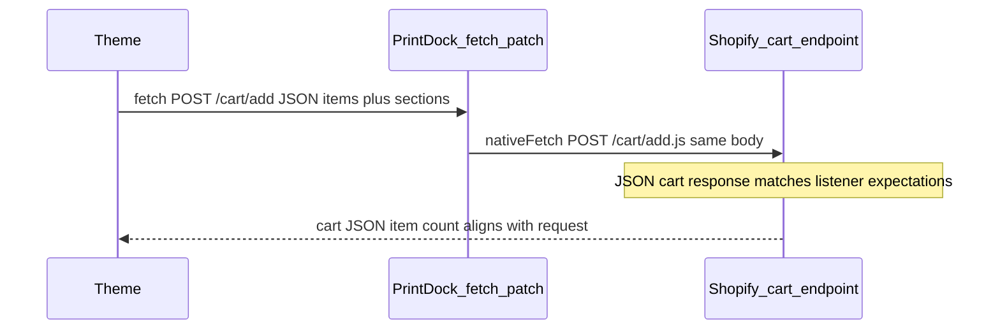

# Reset product-page upload state after successful add-to-cart

## Goal

After a **successful** add-to-cart, clear the PrintDock widget state on the product page so shoppers do not reuse the same in-memory upload session, hidden line properties, or UI that was already committed to the cart. This avoids double-adds, stale `_uc_session` / price tokens, and confusion when changing variant/quantity.

**Out of scope (intentionally):** Calling [`requestServerRemove`](extensions/theme-extension/assets/upload.js) (or similar) for files that are already in the cart. [orders/create webhook](app/routes/webhooks.orders.create.tsx) copies assets and notes that session uploads must not be deleted in a way that breaks line-item “Print Ready” links. Reset is **browser state + localStorage session key only**.

## Current behavior (gap)

- One path already leaves the page: native `fetch("/cart/add.js")` then [`window.location.assign("/cart")`](extensions/theme-extension/assets/upload.js) after success (form multi-item flow).
- **AJAX / drawer** themes: [`postJsonMultiCartAdd`](extensions/theme-extension/assets/upload.js) and multiple `return originalFetch(...)` branches return a `Response` with **no** reset; [`XMLHttpRequest.prototype.send`](extensions/theme-extension/assets/upload.js) mutates the body and returns without observing success.
- [`removeFile`](extensions/theme-extension/assets/upload.js) already encodes the right **local** cleanup pattern: revoke `previewUrl`, clear `uploadedFiles`, [`clearStoredSession`](extensions/theme-extension/assets/upload.js), reset file input, dismiss banners, `renderFileList` / `updateCartState` / `updatePriceDisplay`.

## Implementation approach

### 1. Centralize “soft reset” in `upload.js`

Add something like `resetProductPageUploadSession()` that:

- Aborts any in-flight upload XHRs on current `uploadedFiles` entries (same as `removeFile`).
- Revokes any `previewUrl` object URLs.
- Sets `uploadedFiles = []`, `isUploading = false`, `isBlocked = false`, `lastCartAddBlockReason = null`.
- Calls `clearStoredSession()` (localStorage session + expiry keys).
- Clears `#printdock-file-input` value if present.
- Removes PrintDock hidden inputs from all `form[action*="/cart/add"]` via existing [`clearPrintdockHiddenInputs`](extensions/theme-extension/assets/upload.js) (or equivalent loop).
- Clears inline price node if needed (or rely on `updatePriceDisplay()`).
- Dismisses active banners (reuse the same `activeBanners.forEach` pattern as in `removeFile`).
- Calls `renderFileList()`, `updateCartState()`, `syncUploadControls()` as needed so the add button re-locks when `isRequired` and the dropzone is usable again.

Keep this function **purely client-side**; do **not** POST to `/api/proxy/upload/remove` for successful cart adds.

### 2. Invoke reset on successful **fetch** cart adds

All cart-add handling funnels through [`setupCartAddFetchInterceptor`](extensions/theme-extension/assets/upload.js).

- **`postJsonMultiCartAdd`:** After `nativeFetch` returns, if `res.ok`, call `resetProductPageUploadSession()` (after existing `touchPdNowCartClock` behavior, order is not critical).
- **Every other successful branch** that returns `await originalFetch(...)` for a request that matched `isCartAddRequest`: wrap as `const res = await originalFetch(...); if (res.ok) resetProductPageUploadSession(); return res;` (same for `input.url` / `requestUrl` variants).

**Edge case:** If a theme returns `ok` for a cart add that did not actually include our properties (e.g. passthrough path with empty `getCartProperties()`), resetting is still safe: it only clears local widget state.

### 3. Invoke reset on successful **XHR** cart adds

In [`setupCartAddXHRInterceptor`](extensions/theme-extension/assets/upload.js), for code paths that call `originalSend` with a **mutated** JSON/FormData/params body (PrintDock actually merged fee/session props), register a **one-shot** `load` listener on that XHR: if `status` is 2xx, call `resetProductPageUploadSession()`.

For paths that pass the body through unchanged (`baseProps` empty), you can either skip the listener or still reset when validation had passed—simplest is: if the request URL matched cart add and our interceptor ran past validation, attach the same one-shot success listener to **all** cart-add XHR sends (reset only on 2xx). That keeps behavior consistent with fetch.

### 4. Form submit path that redirects to `/cart`

Optionally call `resetProductPageUploadSession()` immediately before `window.location.assign("/cart")` for consistency (page will unload); low priority but harmless.

### 5. Debug / optional UX

- Under `DEBUG_PRINTDOCK`, log one line when reset runs (e.g. `upload_reset_after_cart_add`) with `{ reason: "fetch_ok" | "xhr_ok" }` for support.
- Optional (merchant-facing): short success copy in the widget (“Added to cart — upload a new file to add another print”). Only add if you want explicit UX feedback; otherwise reset + empty list is enough.

## Files to touch

- [`extensions/theme-extension/assets/upload.js`](extensions/theme-extension/assets/upload.js) — new reset helper + wire into fetch wrapper (`postJsonMultiCartAdd`, merged `originalFetch` returns), XHR `send`, and optionally pre-redirect form path.

No backend or Liquid changes required unless you add optional success copy / block setting later.

## Testing checklist

- Dawn-style **AJAX** add: stay on PDP, confirm files list clears, session cleared from `localStorage`, add button disabled until new upload when required.
- **Form POST** redirect to `/cart`: still lands on cart; no regressions.
- **XHR** cart add theme: verify `load` fires once and resets.
- **Double-click** add: two 2xx responses → two resets; state should remain empty after.
- Confirm cart line still has properties and checkout/order flow unchanged (no storage delete).

---

## Related bug: Cart price / `shop_events_listener` (“different number of items”)

### What your logs show

- Interceptor matches **`/cart/add`** (not `/cart/add.js`): `truncatedUrl: '/cart/add'`, `resolvedPath: '/cart/add'`.
- PrintDock runs correctly through signing and multi-item build: `price_sign_ok`, `build_multi_item_ok` (with `hasSectionsHint: true` — Section Rendering).
- Theme uses **AJAX** (`form_submit_delegated_to_theme_ajax`); fetch layer sends a **JSON** body built by PrintDock.
- Shopify theme asset **`shop_events_listener`** then throws: `Payload body and response have different number of items`.

### Likely cause

Shopify’s storefront cart **JSON API** is the **`/cart/add.js`** endpoint. Posting `Content-Type: application/json` with an `{ items: [...] }` payload to the **non-`.js`** path **`/cart/add`** often returns a **different response shape** (e.g. HTML redirect / non-JSON) than the theme script and `shop_events_listener` expect when they correlate **request items** ↔ **parsed response items**. That mismatch surfaces as your error and can prevent cart UI updates so the displayed line total **does not reflect** Cart Transform pricing even though `_pd_price_token` was submitted.

Evidence in code today: [`postJsonMultiCartAdd`](extensions/theme-extension/assets/upload.js) passes through the caller’s URL (`input.url` / `requestUrl`), so a theme that POSTs to `/cart/add` keeps **`/cart/add`** for JSON (see calls around lines 1494–1506, 1551–1563, 1604–1609, 1644).

### Planned fix (implementation)

1. Add a small helper e.g. `cartAddJsUrl(originalUrl)` that resolves via `URL(original, location.href)`, and if `pathname` ends with **`/cart/add`** but not **`/cart/add.js`**, rewrite to **`/cart/add.js`** (same origin, locale prefix preserved, e.g. `/fr/cart/add` → `/fr/cart/add.js`).
2. Use it **inside** [`postJsonMultiCartAdd`](extensions/theme-extension/assets/upload.js) (or immediately before each `nativeFetch` for PrintDock-built JSON bodies) so every synthesized JSON POST targets **`/cart/add.js`**. Keep `sections` / `sections_url` in body as today.
3. For branches that **`merge`** props but still POST JSON via `originalFetch(input.url, ...)` with rewritten JSON body — apply the **same `.js` URL normalization** whenever the outgoing body is JSON `items`-style cart add (not only multi-item rewrite).
4. Re-test on the same store: console should show `resolvedPath` ending in **`/cart/add.js`** for that request; `shop_events_listener` error should disappear; cart line / drawer should show updated totals if Cart Transform is active.
5. **XHR path:** if any theme posts JSON to `/cart/add` via XHR, apply the same URL normalization there for parity.

### If price is still wrong after URL fix

Then treat as **server-side** Cart Transform: confirm line item properties on [`/cart.js`](https://shopify.dev/docs/api/ajax/reference/cart) include `_pd_price_token` and `_pd_now`, and that the [auto-pricing function input](extensions/auto-pricing/src/cart_transform_run.graphql) reads line attributes and the deployed function matches your cart transform configuration. That is outside the theme URL fix but listed for completeness.

