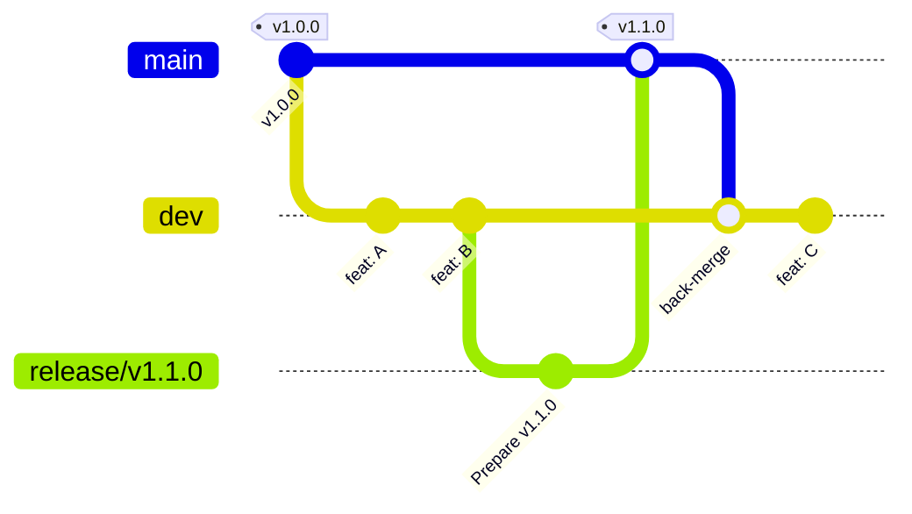

# Git Flow & Conventions

This document defines how PrintDock uses git: branches, naming, commits, PRs, and merges. The release runbook lives in [`RELEASING.md`](./RELEASING.md). The product changelog lives in [`CHANGELOG.md`](./CHANGELOG.md).

## Branching model — Git-Flow-lite

Two long-lived branches plus short-lived working branches.

| Branch                | Purpose                                                                     | Lifetime         |
|-----------------------|-----------------------------------------------------------------------------|------------------|
| `main`                | Production. Every commit is a release merge and is tagged `vX.Y.Z`.        | Permanent        |
| `dev`                 | Integration. All feature work lands here first.                             | Permanent        |
| `feat/<topic>`        | New feature. Branched from `dev`, merged back into `dev`.                  | Days — weeks     |
| `fix/<topic>`         | Non-urgent bug fix. Branched from `dev`, merged back into `dev`.           | Days             |
| `chore/<topic>`       | Refactor, dependency bumps, docs, tooling. Branched from `dev`.            | Days             |
| `release/vX.Y.Z`      | Release prep (version bumps, changelog). Branched from `dev`, merged into `main` then back into `dev`. | Hours — days     |
| `hotfix/vX.Y.Z`       | Urgent production fix. Branched from the previous tag, merged into `main` then back into `dev`. | Hours            |



### Hard rules

1. **Never commit directly to `main`.** All commits on `main` arrive via merges from `release/*` or `hotfix/*` branches.
2. **Never branch a feature off `main`.** Always cut from `dev`.
3. **Always branch a hotfix off the previous tag**, not off `main` (which may contain unreleased work).
4. **Always back-merge `main` into `dev`** after a release or hotfix.
5. **The tag is pushed before the deploy runs.** The production image must equal the tag exactly.

## Branch naming

```
<type>/<short-kebab-case-topic>
```

Allowed types:

| Type        | Use for                                                          | Example                                  |
|-------------|------------------------------------------------------------------|------------------------------------------|
| `feat`      | A new feature or merchant-visible capability.                   | `feat/per-field-pricing-ui`              |
| `fix`       | A non-urgent bug fix going into the next release.               | `fix/upload-cancellation-race`           |
| `chore`     | Refactor, dependency bumps, build/CI, internal-only work.       | `chore/bump-react-router-7.13`           |
| `docs`      | Docs-only change (README, blueprint, this file).                | `docs/clarify-onboarding-flow`           |
| `release`   | Release prep branch. Suffix is the target version.              | `release/v1.1.0`                         |
| `hotfix`    | Urgent prod fix. Suffix is the target patch version.            | `hotfix/v1.0.1`                          |
| `experiment`| Throwaway exploration, never merged.                            | `experiment/new-pricing-engine`          |

Topic guidelines:

- Lowercase, kebab-case. No spaces, no slashes inside the topic.
- 2 — 5 words. Describe the *outcome*, not the file.
- Avoid issue numbers in the branch name unless your tracker URL is the only useful identifier.

## Commits

### Style

PrintDock uses **short, imperative, sentence-case** commit subjects, optionally with a Conventional Commits-style prefix when it adds clarity. Both of these are fine:

```
Improve onboarding flow, billing state, and upload UX
fix(app): unify admin error boundary logging and document signBlob IAM
```

What matters more than the prefix:

- **Imperative mood.** "Add", "Fix", "Refactor" — not "Added", "Fixes".
- **No trailing period.** Subject line ≤ 72 characters.
- **Body explains the *why*** when the diff doesn't make it obvious. Wrap at 72 columns.
- **No mention of tools or AI in the subject line.** "Improve X" is enough; "AI-assisted improve X" is noise.

### Atomic commits on `feat/*`

While developing on a `feat/*` branch, commit often in small atomic steps. They will be **squashed** when the PR is merged into `dev` (see *Merge strategies*), so commit messages on the working branch are scratchpad-quality and don't need to be polished.

The squash commit subject **does** need to be polished — that's the line that ends up in `git log dev`.

### Commits on `release/*` and `hotfix/*`

Use full, polished commit messages here. These commits land on `main` and stay forever.

Recommended pattern:

```
Prepare v1.1.0 release

- Bump package.json to 1.1.0
- Move Unreleased section into 1.1.0 in CHANGELOG.md
- Bump auto-pricing extension to 1.1.0
```

## Pull requests

Even solo, open a PR for every non-trivial change. It forces a sanity pause before merging and keeps an audit trail.

### Title

Match the eventual squash-commit subject. Same rules as commit subjects above.

### Body template

```markdown
## What

One paragraph describing what this PR does.

## Why

Link to the user-facing problem or product decision. If this is fixing a bug, describe how to reproduce.

## How

Notable implementation choices, trade-offs, anything a reviewer (future-you) will want to know in 6 months.

## Verification

- [ ] `npm run typecheck` clean
- [ ] `npm run lint` clean
- [ ] `npm run build` succeeds
- [ ] Manual smoke test: <which flow(s)>
- [ ] Tested on staging Cloud Run revision: <revision id>

## Screenshots / videos

<if any merchant-visible UI changed>
```

### Target branch

| PR source          | Target            |
|--------------------|-------------------|
| `feat/*`, `fix/*`, `chore/*`, `docs/*` | `dev`             |
| `release/vX.Y.Z`   | `main`            |
| `hotfix/vX.Y.Z`    | `main`            |

PRs from `feat/*` should never target `main` directly.

## Merge strategies

| Merging into        | Strategy           | Why                                                                                          |
|---------------------|--------------------|----------------------------------------------------------------------------------------------|
| `dev`               | **Squash & merge** | One feature → one commit on `dev`. Keeps `git log dev` readable as a feature changelog.      |
| `main`              | **`--no-ff` merge**| Each commit on `main` is a *release event*. `git log main --first-parent` is your release history. |
| `dev` (back-merge from `main`) | **`--no-ff` merge** | Preserves the release point in `dev`'s history.                                              |

Concretely:

```bash
# feat → dev: squash on GitHub UI, or:
git checkout dev && git merge --squash feat/topic && git commit && git push

# release/hotfix → main: explicit no-ff merge
git checkout main && git merge --no-ff release/v1.1.0 -m "Release v1.1.0"

# main → dev: back-merge with no-ff
git checkout dev && git merge --no-ff main -m "Back-merge v1.1.0 into dev"
```

**Never rebase `main` or `dev`**. Force-pushing shared branches is forbidden. Rebasing your own short-lived `feat/*` before opening a PR is fine.

## Tags

- Format: `vX.Y.Z` (semver). No `release-` prefix, no calver. The leading `v` is part of the tag.
- Annotated tags only: `git tag -a vX.Y.Z -m "..."`. Lightweight tags don't carry a message and don't show up in `git describe` cleanly.
- Tags only ever live on `main`.
- Never delete or move a tag. If a release is broken, ship a new patch tag.

## Issue & ticket linking (optional)

If you use a tracker (Linear, GitHub Issues, Jira), reference it in the **PR body**, not the branch name:

```
Closes ISSUE-123
```

This keeps branch names readable and lets the tracker do its own auto-linking on merge.

## Quick reference — common workflows

### Start a new feature

```bash
git checkout dev && git pull --ff-only
git checkout -b feat/short-topic
```

### Update a feature branch with the latest `dev`

```bash
git checkout feat/short-topic
git fetch origin
git rebase origin/dev          # only on your own short-lived branch
git push --force-with-lease    # only after rebase
```

### Open the PR

```bash
git push -u origin feat/short-topic
gh pr create --base dev --title "Short imperative subject" --body-file .github/pr-body.md
```

### After the PR merges to `dev`

```bash
git checkout dev && git pull --ff-only
git branch -d feat/short-topic
git push origin --delete feat/short-topic   # if not auto-deleted by GitHub
```

### Cut a release

See [`RELEASING.md`](./RELEASING.md). Do **not** improvise the release flow.

### Ship a hotfix

See [`RELEASING.md`](./RELEASING.md) → "Hotfix flow".

## Anti-patterns to avoid

- **Long-lived `feat/*` branches.** If a feature is taking more than ~2 weeks, split it. Long branches diverge from `dev` and become merge nightmares.
- **Mixing release prep into a feature PR.** Version bumps and CHANGELOG edits belong on a `release/*` branch, not on `feat/*`.
- **Cherry-picking into `main`.** If a fix needs to ship now, cut a `hotfix/*` branch. Don't cherry-pick — it makes back-merges produce phantom conflicts.
- **Letting `dev` drift far ahead of `main` indefinitely.** If `dev` has 50+ commits ahead of `main`, you are due for a release. Cut one.
- **Renaming or moving tags.** Once `vX.Y.Z` is pushed, it is immutable.

## Glossary

- **Tag** — an immutable named pointer at a specific commit, e.g. `v1.0.0`.
- **Release merge** — the `--no-ff` merge of `release/vX.Y.Z` into `main`. The merge commit on `main` is the release.
- **Back-merge** — merging `main` back into `dev` after a release or hotfix, so `dev` has the new version metadata and any fixes.
- **First-parent history** — `git log --first-parent main` shows only the merges into `main`, i.e. just the releases.
