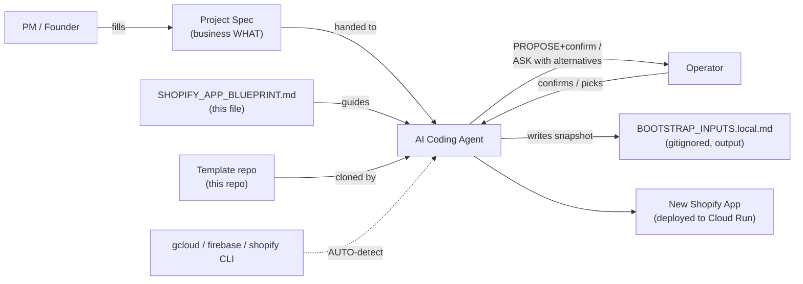
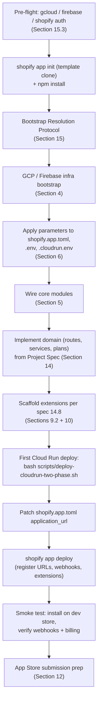
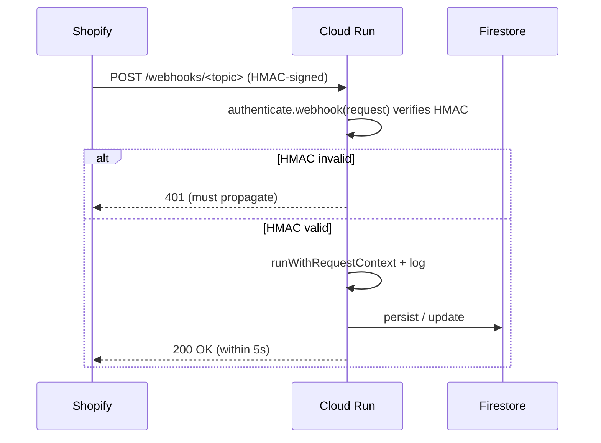
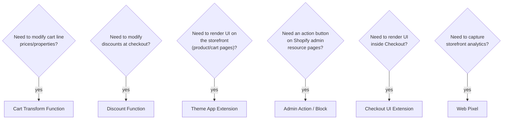
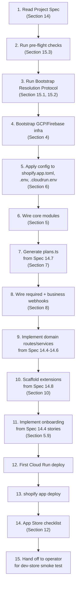

# Shopify App Blueprint

A reusable, project-agnostic blueprint for building production-grade Shopify apps on the proven stack:
**React Router 7 + Polaris + App Bridge + Firebase Admin (Firestore + Storage) + Cloud Run + Shopify Functions/Theme Extensions + Managed Pricing.**

This document is everything an AI agent needs to bootstrap a new Shopify app end-to-end. The **only** missing input is a filled-in [Project Spec Template](#14-project-spec-template) describing **what** the app should do. All technical and infra parameters are resolved automatically by the [Bootstrap Resolution Protocol](#15-bootstrap-resolution-protocol).

## Split-document index (recommended)

For context-efficient execution, prefer this split set:

- `BLUEPRINT_EXECUTION.md` — process control and run-order
- `BLUEPRINT_CORE.md` — architecture and implementation defaults
- `BLUEPRINT_REFERENCE.md` — pitfalls, review risk, and glossary

Use this file (`SHOPIFY_APP_BLUEPRINT.md`) as the canonical long-form source when deep detail is needed.

---

## Table of contents

- [0. How to use this blueprint](#0-how-to-use-this-blueprint)
- [1. Tech Stack & Why](#1-tech-stack--why)
- [2. Reference Repo Layout](#2-reference-repo-layout)
- [3. Bootstrap Order of Operations](#3-bootstrap-order-of-operations)
- [4. GCP / Firebase Infrastructure Bootstrap](#4-gcp--firebase-infrastructure-bootstrap)
- [5. Core Modules every app needs](#5-core-modules-every-app-needs)
- [6. Configuration Parameters Table](#6-configuration-parameters-table)
- [7. Plans & Limits Pattern](#7-plans--limits-pattern)
- [8. Webhooks Catalog](#8-webhooks-catalog)
- [9. Decision Areas with Alternatives](#9-decision-areas-with-alternatives)
- [10. Extension Detailed Recipes](#10-extension-detailed-recipes)
- [11. Storefront Integration Patterns](#11-storefront-integration-patterns)
- [12. App Store Submission Checklist](#12-app-store-submission-checklist)
- [13. AI Implementation Workflow](#13-ai-implementation-workflow)
- [14. Project Spec Template](#14-project-spec-template)
- [15. Bootstrap Resolution Protocol](#15-bootstrap-resolution-protocol)
- [16. Pitfalls & Lessons from PrintDock](#16-pitfalls--lessons-from-printdock)
- [17. Glossary & References](#17-glossary--references)

---

## 0. How to use this blueprint

### Inputs

This blueprint requires **one human input** per new app:

1. A filled-in **[Project Spec Template](#14-project-spec-template)** — pure WHAT (business). Filled by the founder/PM.

Everything else (technical params, infra IDs, secrets, scope list, plan codes, webhook subscriptions) is resolved by the AI through the [Bootstrap Resolution Protocol](#15-bootstrap-resolution-protocol): CLI auto-detection first, then propose-and-confirm with alternatives, finally direct ask only when no signal exists. Resolved values are snapshot to a gitignored `BOOTSTRAP_INPUTS.local.md` for reproducibility.

### AI read order (context-efficient)

This blueprint includes both **execution instructions** and **reference material**.

- **Read first (required, in order):** Sections **0 → 14 → 13 → 15**
- **Read on demand (reference):** Sections **1–12, 16, 17**
- **Rule:** do not read every section linearly before starting implementation; read only what the current workflow step needs.

### Workflow



### Convention used in this document

- `{{APP_NAME}}`, `{{APP_NAME_SLUG}}`, `{{APP_PROXY_SUBPATH}}`, `{{FIRESTORE_PREFIX}}`, `{{PROJECT_ID}}`, `{{SERVICE_NAME}}`, `{{SERVICE_REGION}}` — placeholders the AI substitutes during bootstrap.
- `# AUTO`, `# PROPOSE`, `# ASK` — annotations indicating how the value is resolved (see [Section 15](#15-bootstrap-resolution-protocol)).

---

## 1. Tech Stack & Why

These are **house-stack defaults** validated in shipped apps on this template. They are defaults for consistency and speed, not universal truths for every Shopify app. Choose alternatives when the spec requires it (for example: relational-heavy analytics, multi-service architecture, or strict regional/compliance constraints). For decision areas where alternatives are documented, see [Section 9](#9-decision-areas-with-alternatives).

| Layer | Choice | Why |
|---|---|---|
| Admin frontend | React Router 7 (SSR), Vite, TypeScript | Official template direction; SSR for fast embedded admin |
| UI kit | `@shopify/polaris` + `@shopify/polaris-icons` | Native admin look; accessibility built-in |
| Embedding | `@shopify/app-bridge-react` (`embedded` mode) | Required for embedded admin; modal/toast/nav-menu primitives |
| Shopify SDK | `@shopify/shopify-app-react-router`, `@shopify/shopify-api` | Auth, OAuth, webhook verification, GraphQL Admin client |
| Backend runtime | Node.js 20 (LTS) | Stable, supported by `@shopify/shopify-api` |
| Database | Firestore (via `firebase-admin`) | Serverless, scales to zero, native ADC on Cloud Run |
| File storage | Firebase Storage (via `firebase-admin/storage`) | v4 signed URLs for direct browser uploads, free tier |
| Auth identity | Firebase Auth (via `firebase-admin/auth`), if app needs end-customer accounts | Optional; otherwise skip |
| Session storage | Custom `FirestoreSessionStorage` adapter | Same DB as app data; multi-instance safe |
| Hosting | Google Cloud Run (Docker) | Scales to zero, ADC, same project as Firestore |
| Build | Docker multi-stage (`node:20-alpine`) | Reproducible, small image |
| Cron / background | Cloud Scheduler → HTTP route in app | Simplest, no extra infra |
| Validation | `zod` | Type-safe schemas across loaders/actions/webhooks |
| Image processing | `sharp` (only if app needs it) | Native bindings, fast |
| PDF processing | `pdf-lib` (only if app needs it) | Pure JS, no system deps |
| GraphQL codegen | `@shopify/api-codegen-preset`, `graphql-config` | Type-safe Admin API queries |
| Linting | ESLint + `@typescript-eslint` | Standard |
| Formatting | Prettier | Standard |
| Logging | Custom request-scoped JSON logger (Cloud Logging-friendly) | Structured, scrubs secrets, request IDs |
| Billing | Shopify **Managed Pricing** (Partner Dashboard hosted) | No `appSubscriptionCreate` mutation; merchant picks plan in Shopify-hosted UI |

**What is intentionally NOT included** unless the spec asks for it: Prisma, PostgreSQL, Redis, Next.js, Remix v2, third-party analytics SDKs, custom CSS frameworks (Polaris is the system).

---

## 2. Reference Repo Layout

```
{{APP_NAME_SLUG}}/
├── app/                           # React Router app (admin UI + server routes)
│   ├── components/                # Reusable Polaris components
│   ├── config/                    # Plan limits, billing helpers (per-app constants)
│   │   ├── plans.ts               # PlanCode + PlanLimits + helpers (Section 7)
│   │   └── billing.ts             # Managed-pricing URL helpers
│   ├── hooks/                     # Client React hooks
│   ├── lib/                       # Server utilities (no domain logic)
│   │   ├── logger.server.ts       # Request-scoped JSON logger
│   │   └── webhook-action.server.ts  # rethrowIfShopifyWebhookResponse helper
│   ├── routes/                    # Flat-file routes (React Router fs-routes)
│   │   ├── _index/                # Public marketing/landing (optional)
│   │   ├── auth.$.tsx             # OAuth callback
│   │   ├── auth.login/            # Public shop-domain entry form
│   │   ├── app.tsx                # Embedded admin shell (AppProvider + nav-menu)
│   │   ├── app._index.tsx         # Admin dashboard
│   │   ├── app.onboarding.tsx     # First-run setup (theme block, billing, etc.)
│   │   ├── app.plans.tsx          # Pricing page (links to managed pricing)
│   │   ├── api.proxy.*.tsx        # App Proxy routes (storefront-callable)
│   │   ├── webhooks.*.tsx         # Webhook handlers
│   │   └── cron.*.tsx             # Scheduled HTTP routes
│   ├── services/                  # Domain logic (per-app, derived from spec)
│   ├── types/                     # Generated GraphQL types + domain types
│   ├── utils/                     # Pure helpers
│   ├── entry.server.tsx           # SSR entry
│   ├── firebase.server.ts         # firebase-admin init
│   ├── firestore-session-storage.ts  # Shopify session storage adapter
│   ├── shopify.server.ts          # shopifyApp() config
│   ├── root.tsx                   # React Router root
│   └── routes.ts                  # `flatRoutes()` from @react-router/fs-routes
├── extensions/                    # npm workspaces: each is a Shopify extension
│   └── {{ext-handle}}/
├── scripts/                       # Reusable shell scripts (ship with template)
│   ├── deploy-cloudrun-two-phase.sh   # REUSE AS-IS, parameterized via .cloudrun.env
│   ├── setup-cloudrun-env.sh          # REUSE AS-IS, generates .cloudrun.env from .env
│   └── migrate-firestore-hierarchy.mjs  # COPY & ADAPT when schema changes
├── docs/                          # Reusable docs (carry over verbatim)
│   ├── DEPLOY_CLOUD_RUN.md
│   ├── GCLOUD_COMMANDS.md
│   ├── COMMANDS.md
│   └── OBSERVABILITY.md
├── public/                        # Static assets
├── shopify.app.toml               # Shopify CLI config (parameterized — see Section 6)
├── shopify.web.toml               # Web component declaration for `shopify app dev`
├── Dockerfile                     # REUSE AS-IS (only PORT/CMD if start script differs)
├── .dockerignore                  # REUSE AS-IS
├── .cloudrun.env                  # The only deploy file that changes per app (see Section 6)
├── .env                           # Local dev env (gitignored)
├── .env.example                   # Committed template of .env keys
├── .graphqlrc.ts                  # GraphQL codegen config (REUSE AS-IS)
├── .gitignore                     # REUSE AS-IS (extend with BOOTSTRAP_INPUTS.local.md)
├── package.json                   # Workspaces root; deps and scripts
├── tsconfig.json                  # REUSE AS-IS
├── vite.config.ts                 # REUSE AS-IS
├── BOOTSTRAP_INPUTS.local.md      # Snapshot of resolved bootstrap values (gitignored, output)
└── README.md                      # Per-app overview
```

### Reusable assets — what to do with them

| Asset | Action | Notes |
|---|---|---|
| `scripts/deploy-cloudrun-two-phase.sh` | **Reuse as-is** | Reads `.cloudrun.env`; rotates Secret Manager `shopify-api-key/secret`; offers post-deploy `shopify.app.toml` patch and `shopify app deploy`. |
| `scripts/setup-cloudrun-env.sh` | **Reuse as-is** | Source it (`source scripts/setup-cloudrun-env.sh`) — generates `.cloudrun.env` from `.env`. |
| `scripts/migrate-firestore-hierarchy.mjs` | **Copy & adapt** | Pattern for one-shot Firestore data migrations using `firebase-admin`. |
| `Dockerfile`, `.dockerignore` | **Reuse as-is** | Multi-stage `node:20-alpine`; only change PORT if you change the listener. |
| `docs/DEPLOY_CLOUD_RUN.md`, `docs/GCLOUD_COMMANDS.md`, `docs/COMMANDS.md`, `docs/OBSERVABILITY.md` | **Carry over verbatim** | Generic guides; rename references to `{{APP_NAME}}` / `{{SERVICE_NAME}}`. |
| `.graphqlrc.ts` | **Reuse as-is** | Auto-discovers extensions and generates types. |
| `app/lib/logger.server.ts` | **Reuse as-is** | Request-scoped JSON logger; no domain logic. |
| `app/lib/webhook-action.server.ts` | **Reuse as-is** | Tiny helper for webhook error rethrow. |
| `app/firebase.server.ts` | **Reuse as-is** | firebase-admin init using ADC or service account JSON. |
| `app/firestore-session-storage.ts` | **Reuse as-is** | Shopify session storage adapter for Firestore. |

---

## 3. Bootstrap Order of Operations

The AI executes these steps in order. Each step references later sections for detail.



### Numbered steps

1. **Pre-flight**: AI runs `gcloud auth list`, `firebase login:list`, `shopify version` and stops with clear instructions if any auth is missing (see [15.3](#153-pre-flight-checks)).
2. **Template clone**: `shopify app init {{APP_NAME_SLUG}} --template <this-repo-url>` then `npm install` (workspaces installs extensions too).
3. **Bootstrap Resolution Protocol** ([Section 15](#15-bootstrap-resolution-protocol)): AI auto-detects/proposes every parameter and writes `BOOTSTRAP_INPUTS.local.md`.
4. **GCP / Firebase infra** ([Section 4](#4-gcp--firebase-infrastructure-bootstrap)): create service account, enable APIs, init Firestore, create Storage bucket if missing, set Secret Manager secrets.
5. **Apply parameters** ([Section 6](#6-configuration-parameters-table)): edit `shopify.app.toml`, write `.env`, write `.cloudrun.env`, set `.gitignore`.
6. **Wire core modules** ([Section 5](#5-core-modules-every-app-needs)): OAuth, session storage, webhooks (required + business), billing, logger, GraphQL codegen, app proxy (if needed), onboarding.
7. **Implement domain** from Project Spec sections 14.4–14.7: routes, services, plan limits, data entities.
8. **Scaffold extensions** per spec 14.8 using recipes in [Section 10](#10-extension-detailed-recipes).
9. **First deploy** (two-phase, since `SHOPIFY_APP_URL` is not known until first deploy):
   ```bash
   source scripts/setup-cloudrun-env.sh   # interactive: writes .cloudrun.env from .env
   bash scripts/deploy-cloudrun-two-phase.sh
   ```
10. **Patch `shopify.app.toml`** with the Cloud Run URL (the deploy script offers to do this interactively).
11. **`shopify app deploy`**: register URLs, webhook subscriptions, extensions in the Partner Dashboard.
12. **Verify**: install on dev store, trigger each webhook (Shopify Partner Dashboard → Webhooks → Send test), confirm billing with **$0 private test plans** on allowlisted dev stores (see `docs/DEV_STORE_BILLING_TESTING.md`).
13. **App Store prep** ([Section 12](#12-app-store-submission-checklist)).

---

## 4. GCP / Firebase Infrastructure Bootstrap

> The AI runs these in order **after** [Section 15.3 pre-flight checks](#153-pre-flight-checks) pass and `PROJECT_ID` is resolved.

### 4.1 Enable required APIs

```bash
gcloud services enable \
  run.googleapis.com \
  cloudbuild.googleapis.com \
  artifactregistry.googleapis.com \
  secretmanager.googleapis.com \
  firestore.googleapis.com \
  iam.googleapis.com \
  cloudscheduler.googleapis.com \
  --project={{PROJECT_ID}}
```

### 4.2 Initialize Firestore (if not already)

```bash
gcloud firestore databases create \
  --location={{SERVICE_REGION}} \
  --project={{PROJECT_ID}}  # idempotent: errors harmlessly if exists
```

### 4.3 Verify / create the Firebase Storage bucket

```bash
gcloud storage buckets list --project={{PROJECT_ID}} \
  --filter="name~firebasestorage.app OR name~appspot.com" \
  --format='value(name)'
# If empty, create via Firebase Console (Storage → Get started) — the bucket name
# becomes {{PROJECT_ID}}.firebasestorage.app and is set in .env / .cloudrun.env.
```

### 4.4 Service account for app runtime

```bash
gcloud iam service-accounts create app-runtime \
  --display-name="App runtime" \
  --project={{PROJECT_ID}}

SA="app-runtime@{{PROJECT_ID}}.iam.gserviceaccount.com"

# Firestore + Storage access
gcloud projects add-iam-policy-binding {{PROJECT_ID}} \
  --member="serviceAccount:$SA" --role="roles/datastore.user"
gcloud projects add-iam-policy-binding {{PROJECT_ID}} \
  --member="serviceAccount:$SA" --role="roles/storage.objectAdmin"

# Self-signing for v4 signed URLs (only if app generates presigned upload URLs)
gcloud iam service-accounts add-iam-policy-binding "$SA" \
  --member="serviceAccount:$SA" \
  --role="roles/iam.serviceAccountTokenCreator" \
  --project={{PROJECT_ID}}

# Local dev key (gitignored)
gcloud iam service-accounts keys create ./firebase-credentials.json \
  --iam-account="$SA" \
  --project={{PROJECT_ID}}
```

### 4.5 Secret Manager (production secrets)

The deploy script (`scripts/deploy-cloudrun-two-phase.sh`) expects secrets named **`shopify-api-key`** and **`shopify-api-secret`**. It creates them on first run if missing, or rotates by adding a new version.

```bash
echo -n "$SHOPIFY_API_KEY" | gcloud secrets create shopify-api-key \
  --data-file=- --project={{PROJECT_ID}}
echo -n "$SHOPIFY_API_SECRET" | gcloud secrets create shopify-api-secret \
  --data-file=- --project={{PROJECT_ID}}
```

For additional secrets (e.g. third-party API keys from spec 14.12), follow the same pattern and reference them in the deploy script's `--update-secrets` flag.

### 4.6 Cloud Run service

The deploy script handles this; `gcloud run deploy` is run twice (two-phase) because `SHOPIFY_APP_URL` is the service URL itself and isn't known until after the first deploy.

```bash
source scripts/setup-cloudrun-env.sh   # writes .cloudrun.env
bash scripts/deploy-cloudrun-two-phase.sh
```

### 4.7 Cloud Scheduler (only if app has cron routes)

```bash
gcloud scheduler jobs create http {{APP_NAME_SLUG}}-cron-retention \
  --schedule="0 3 * * *" \
  --uri="https://{{SERVICE_NAME}}-{{HASH}}-{{REGION}}.a.run.app/cron/{{job-name}}" \
  --http-method=POST \
  --headers="X-Cron-Secret={{CRON_SECRET}}" \
  --location={{SERVICE_REGION}} \
  --project={{PROJECT_ID}}
```

The cron HTTP route must verify the secret header (see [Section 9.4](#94-background--cron-jobs) for the route pattern).

### 4.8 Custom domain (optional)

```bash
gcloud beta run domain-mappings create \
  --service={{SERVICE_NAME}} \
  --domain={{CUSTOM_DOMAIN}} \
  --region={{SERVICE_REGION}} \
  --project={{PROJECT_ID}}
```

Update `shopify.app.toml` `application_url`, `[auth].redirect_urls`, and `[app_proxy].url` to use the custom domain after DNS propagates.

### 4.9 Same-project rule

Cloud Run and Firebase **must share the same `PROJECT_ID`** for ADC to work without service account JSON. The Bootstrap Resolution Protocol enforces this (`FIREBASE_PROJECT_ID` defaults to `PROJECT_ID`).

---

## 5. Core Modules every app needs

These are reusable patterns. AI copies them verbatim and only swaps placeholders. None of them contain domain logic.

### 5.1 Shopify OAuth (`app/shopify.server.ts`)

```ts
import "@shopify/shopify-app-react-router/adapters/node";
import {
  ApiVersion,
  AppDistribution,
  shopifyApp,
} from "@shopify/shopify-app-react-router/server";
import { FirestoreSessionStorage } from "./firestore-session-storage";

const shopify = shopifyApp({
  apiKey: process.env.SHOPIFY_API_KEY,
  apiSecretKey: process.env.SHOPIFY_API_SECRET || "",
  apiVersion: ApiVersion.{{API_VERSION_ENUM}}, // e.g. October25
  scopes: process.env.SCOPES?.split(","),
  appUrl: process.env.SHOPIFY_APP_URL || "",
  authPathPrefix: "/auth",
  sessionStorage: new FirestoreSessionStorage(),
  distribution: AppDistribution.AppStore,
  future: { expiringOfflineAccessTokens: true },
  ...(process.env.SHOP_CUSTOM_DOMAIN
    ? { customShopDomains: [process.env.SHOP_CUSTOM_DOMAIN] }
    : {}),
});

export default shopify;
export const apiVersion = ApiVersion.{{API_VERSION_ENUM}};
export const addDocumentResponseHeaders = shopify.addDocumentResponseHeaders;
export const authenticate = shopify.authenticate;
export const unauthenticated = shopify.unauthenticated;
export const login = shopify.login;
export const registerWebhooks = shopify.registerWebhooks;
export const sessionStorage = shopify.sessionStorage;
```

OAuth routes (`app/routes/auth.$.tsx`) are minimal:

```ts
import type { LoaderFunctionArgs } from "react-router";
import { authenticate } from "../shopify.server";
import { boundary } from "@shopify/shopify-app-react-router/server";

export const loader = async ({ request }: LoaderFunctionArgs) => {
  await authenticate.admin(request);
  return null;
};
export const headers = boundary.headers;
```

### 5.2 Firestore session storage adapter (`app/firestore-session-storage.ts`)

```ts
import { SessionStorage } from "@shopify/shopify-app-session-storage";
import { Session } from "@shopify/shopify-api";
import { db } from "./firebase.server";

export class FirestoreSessionStorage implements SessionStorage {
  private collection = db.collection("shopify_sessions");

  async storeSession(session: Session): Promise<boolean> {
    await this.collection.doc(session.id).set(session.toObject());
    return true;
  }
  async loadSession(id: string): Promise<Session | undefined> {
    const doc = await this.collection.doc(id).get();
    if (!doc.exists) return undefined;
    const data = doc.data()!;
    if (data.expires && typeof data.expires === "string") {
      data.expires = new Date(data.expires);
    } else if (data.expires?.toDate) {
      data.expires = data.expires.toDate();
    }
    return new Session(data as any);
  }
  async deleteSession(id: string): Promise<boolean> { /* doc.delete() */ return true; }
  async deleteSessions(ids: string[]): Promise<boolean> { /* batch.delete */ return true; }
  async findSessionsByShop(shop: string): Promise<Session[]> {
    const snap = await this.collection.where("shop", "==", shop).get();
    return snap.docs.map((d) => new Session(d.data() as any));
  }
}
```

### 5.3 firebase-admin init (`app/firebase.server.ts`)

```ts
import { initializeApp, getApps, cert, applicationDefault } from "firebase-admin/app";
import { getFirestore } from "firebase-admin/firestore";
import { getStorage } from "firebase-admin/storage";
import { getAuth } from "firebase-admin/auth";

if (!getApps().length) {
  let credential;
  if (process.env.FIREBASE_SERVICE_ACCOUNT_JSON) {
    credential = cert(JSON.parse(process.env.FIREBASE_SERVICE_ACCOUNT_JSON));
  } else {
    credential = applicationDefault();  // Cloud Run uses the runtime SA
  }
  initializeApp({
    credential,
    storageBucket: process.env.FIREBASE_STORAGE_BUCKET,
    projectId: process.env.FIREBASE_PROJECT_ID,
  });
}

export const db = getFirestore();
export const storage = getStorage();
export const auth = getAuth();
```

### 5.4 Required webhooks

Wire **always-required** topics in `shopify.app.toml`:

```toml
[webhooks]
api_version = "{{API_VERSION}}"  # e.g. "2026-07"

  [[webhooks.subscriptions]]
  topics = [ "app/uninstalled" ]
  uri = "/webhooks/app/uninstalled"

  [[webhooks.subscriptions]]
  topics = [ "app/scopes_update" ]
  uri = "/webhooks/app/scopes_update"

  [[webhooks.subscriptions]]
  topics = [ "app_subscriptions/update" ]
  uri = "/webhooks/app_subscriptions/update"

  [[webhooks.subscriptions]]
  uri = "/webhooks/compliance"
  compliance_topics = [ "customers/data_request", "customers/redact", "shop/redact" ]
```

Generic webhook handler skeleton (`app/routes/webhooks.<topic>.tsx`):

```ts
import type { ActionFunctionArgs } from "react-router";
import { authenticate } from "../shopify.server";
import { rethrowIfShopifyWebhookResponse } from "../lib/webhook-action.server";
import { log, runWithRequestContext, setLogShopDomain } from "../lib/logger.server";

export const action = async ({ request }: ActionFunctionArgs) => {
  return runWithRequestContext(request, async () => {
    try {
      const { shop, topic, payload } = await authenticate.webhook(request);
      setLogShopDomain(shop);
      log.event("webhook_received", { topic, shopDomain: shop });

      // ... business logic per topic ...

      log.event("webhook_processed", { topic, shopDomain: shop });
      return new Response();
    } catch (err) {
      rethrowIfShopifyWebhookResponse(err);  // 401/400/405 must propagate
      log.error("webhook_failed", err, {});
      return new Response("Error", { status: 500 });
    }
  });
};
```

GDPR compliance handler (`app/routes/webhooks.compliance.tsx`) **must** branch on the three compliance topics and **must** return 200 within 5 seconds (heavy work is queued, not done inline). See full implementation pattern referenced in the template's `app/routes/webhooks.compliance.tsx`.

### 5.5 Billing wiring

Two pieces:

1. `app/routes/webhooks.app_subscriptions.update.tsx` — listens for plan changes and writes the resolved plan code to Firestore (`shops/{domain}.planCode` and `shops/{domain}/billing/current`). Maps subscription names to `PlanCode` via `planCodeFromSubscriptionName()` from [Section 7](#7-plans--limits-pattern). On `CANCELLED|DECLINED|EXPIRED|FROZEN|ON_HOLD` → downgrade to `free`.
2. `app/routes/app.tsx` (loader) — on every admin request, query `currentAppInstallation { activeSubscriptions }` and reconcile (in case the webhook was missed). Pattern:
   ```ts
   const response = await admin.graphql(`
     query { currentAppInstallation {
       activeSubscriptions { id name status }
       accessScopes { handle }
     } }
   `);
   await reconcileBillingPlanFromShopifySubscriptions(session.shop, data.activeSubscriptions);
   ```

### 5.6 Request-scoped logger (`app/lib/logger.server.ts`)

Reuse this module verbatim. Key features:
- `runWithRequestContext(request, fn)` — `AsyncLocalStorage`-backed; injects `requestId`, `route`, `method`, `shopDomain` into every log line.
- `log.info / .warn / .error / .event / .debug` — JSON to stdout/stderr (Cloud Logging-friendly).
- Shallow scrubbing of keys matching `accessToken | apiSecret | password | authorization | cookie | signedUrl | refreshToken | secret | api_key | token$`.
- Filter via `LOG_LEVEL` env var (`debug | info | warn | error`).

Wrap **every** loader, action, and webhook in `runWithRequestContext(request, async () => { ... })`.

### 5.7 GraphQL Admin codegen (`.graphqlrc.ts`)

Reuse verbatim. It auto-discovers extensions and generates types into `app/types/`. Run `npm run graphql-codegen` after writing new queries.

```ts
import fs from "fs";
import { ApiVersion } from "@shopify/shopify-app-react-router/server";
import { shopifyApiProject, ApiType } from "@shopify/api-codegen-preset";

const config = {
  projects: {
    default: shopifyApiProject({
      apiType: ApiType.Admin,
      apiVersion: ApiVersion.{{API_VERSION_ENUM}},
      documents: ["./app/**/*.{js,ts,jsx,tsx}"],
      outputDir: "./app/types",
    }),
  },
};

// Auto-add per-extension projects if extensions/<name>/schema.graphql exists
for (const entry of fs.readdirSync("./extensions")) {
  const schema = `./extensions/${entry}/schema.graphql`;
  if (fs.existsSync(schema)) {
    (config.projects as any)[entry] = {
      schema,
      documents: [`./extensions/${entry}/**/*.graphql`],
    };
  }
}

export default config;
```

### 5.8 App proxy route pattern (`app/routes/api.proxy.<name>.tsx`)

Storefront-callable. `authenticate.public.appProxy(request)` does HMAC verification automatically.

```ts
import { data } from "react-router";
import type { LoaderFunctionArgs } from "react-router";
import { authenticate } from "../shopify.server";
import { log, runWithRequestContext, setLogShopDomain } from "../lib/logger.server";

export async function loader({ request }: LoaderFunctionArgs) {
  return runWithRequestContext(request, async () => {
    const { session } = await authenticate.public.appProxy(request);
    if (!session) return data({ error: "Unauthorized" }, { status: 401 });
    setLogShopDomain(session.shop);
    // ... read query params, return JSON ...
    return data({ ok: true });
  });
}
```

`shopify.app.toml`:

```toml
[app_proxy]
url = "https://{{SERVICE_NAME}}-{{HASH}}-{{REGION}}.a.run.app"
subpath = "{{APP_PROXY_SUBPATH}}"
prefix = "apps"
```

Storefront calls `https://{{shop}}/apps/{{APP_PROXY_SUBPATH}}/proxy/<name>?productId=...` → Shopify forwards to `https://your-app/api/proxy/<name>` with HMAC.

### 5.9 Onboarding / setup-status route pattern

Pattern (used in `app/routes/app.tsx` loader):

```ts
const setupComplete = await isAppSetupComplete(admin, session.shop);
if (!setupComplete && !isPathExemptFromSetupRedirect(path)) {
  const url = new URL(`/app/onboarding${currentUrl.search}`, currentUrl.origin);
  url.searchParams.set("returnTo", `${path}${currentUrl.search}`);
  throw redirect(`${url.pathname}${url.search}`);
}
```

`isAppSetupComplete()` checks: theme app extension enabled (if applicable), at least one billing plan resolved (or explicitly `free`), required Shopify resources present. Implementation lives in `app/services/app-setup-status.server.ts` and is **derived from spec 14.4 onboarding stories**.

`isPathExemptFromSetupRedirect()` returns true for `/app/onboarding`, `/app/plans`, and any other "do this first" pages.

---

## 6. Configuration Parameters Table

Every value that changes per app. The Bootstrap Resolution Protocol ([Section 15](#15-bootstrap-resolution-protocol)) fills these.

### 6.1 `shopify.app.toml`

| Key | Source | Example |
|---|---|---|
| `client_id` | from `shopify app init` | `53d400d30cdc04626d5b6dc0ed02d0f4` |
| `name` | spec 14.1 | `{{APP_NAME}}` |
| `application_url` | Cloud Run service URL after first deploy | `https://{{SERVICE_NAME}}-...run.app` |
| `embedded` | always `true` | `true` |
| `[access_scopes].scopes` | derived from spec features | `read_products,read_orders,write_cart_transforms` |
| `[auth].redirect_urls` | `["{{APP_URL}}/auth/callback"]` | |
| `[app_proxy].subpath` | `{{APP_PROXY_SUBPATH}}` (default = slug) | `myapp` |
| `[app_proxy].prefix` | always `apps` | `apps` |
| `[app_proxy].url` | same as `application_url` | |
| `[webhooks].api_version` | current stable Admin API version | `2026-07` |
| `[[webhooks.subscriptions]]` blocks | always-required + spec 14.9 | see [Section 5.4](#54-required-webhooks) |
| `[build].automatically_update_urls_on_dev` | `true` | |

### 6.2 `.env` (gitignored)

| Key | Notes |
|---|---|
| `SHOPIFY_API_KEY` | Auto-written by `shopify app init` |
| `SHOPIFY_API_SECRET` | Auto-written by `shopify app init` |
| `SHOPIFY_APP_URL` | Cloud Run service URL after first deploy |
| `SCOPES` | Must match `shopify.app.toml` exactly (comma-separated) |
| `FIREBASE_PROJECT_ID` | = `PROJECT_ID` |
| `FIREBASE_STORAGE_BUCKET` | `{{PROJECT_ID}}.firebasestorage.app` |
| `GOOGLE_APPLICATION_CREDENTIALS` | Local: `./firebase-credentials.json` (Cloud Run uses ADC, leave unset there) |
| `FIREBASE_SERVICE_ACCOUNT_JSON` | Alternative to file path: full JSON string |
| `LOG_LEVEL` | `debug` locally, `info` in production |
| `STORAGE_RETENTION_CRON_SECRET` | Only if app has cron routes; random 32+ chars |
| `SHOPIFY_APP_HANDLE` | Optional override for managed-pricing URL handle (default = slug) |
| `SHOP_CUSTOM_DOMAIN` | Optional, if app must accept a non-`.myshopify.com` shop domain |

A committed `.env.example` documents these keys with empty values.

### 6.3 `.cloudrun.env` (gitignored, the only deploy file that changes per app)

```bash
export PROJECT_ID="{{PROJECT_ID}}"
export SERVICE_NAME="{{SERVICE_NAME}}"          # default {{APP_NAME_SLUG}}-service
export SERVICE_REGION="{{SERVICE_REGION}}"      # default us-central1 or Firestore region
export FIREBASE_PROJECT_ID="{{PROJECT_ID}}"
export FIREBASE_STORAGE_BUCKET="{{PROJECT_ID}}.firebasestorage.app"
export SCOPES="{{SCOPES_CSV}}"                  # must match shopify.app.toml
```

### 6.4 Other

| Location | Key | When to change |
|---|---|---|
| `Dockerfile` | `ENV PORT=8080` | Only if you change the server listener port |
| `app/firestore-session-storage.ts` | `db.collection("shopify_sessions")` | Rare — keep `shopify_sessions` for portability |
| Firestore root collections | `shops`, `shopify_sessions`, plus per-app collections | Per-app; spec-driven |
| `app/config/plans.ts` | `PlanCode` literal union, `PLANS` map | Per-app; from spec 14.7 |
| `.graphqlrc.ts` | `apiVersion` enum | Bump alongside `shopify.app.toml` |

---

## 7. Plans & Limits Pattern

A single source of truth for tier-based feature gating. The AI generates `app/config/plans.ts` from spec 14.7. Skeleton:

```ts
// {{PLAN_CODES}} are derived from spec 14.7 plan names (slugified, lowercased).
export type PlanCode = "{{plan-1}}" | "{{plan-2}}" | "{{plan-3}}";

/** Reasons the app shows an upgrade prompt. Map each reason → the plan that unlocks it. */
export type UpgradeReason =
  | "{{reason-1}}"
  | "{{reason-2}}";

export interface PlanLimits {
  planCode: PlanCode;
  displayName: string;
  // numeric limits derived from spec 14.7 feature gates:
  // e.g. maxItems, maxStorageBytes, maxApiCallsPerDay, retentionDays
  // boolean feature flags:
  // e.g. advancedValidation, customBranding, prioritySupport
}

export const PLANS: Record<PlanCode, PlanLimits> = {
  // one entry per tier — values come from spec 14.7
};

/** Canonical Shopify Managed Pricing plan names (without "AppName " prefix or frequency suffix). */
export const PLAN_SUBSCRIPTION_NAMES: Record<PlanCode, string> = {
  // e.g. starter: "Starter"
};

/** Strips optional frequency suffix from managed-pricing titles, e.g. "Pro Monthly". */
const FREQ_SUFFIX = /\s*(monthly|yearly|annual|annually|per\s+month|per\s+year)$/i;
function normalize(name: string): string {
  return name.trim().toLowerCase()
    .replace(new RegExp(`^{{APP_NAME_SLUG}}\\s+`), "")
    .replace(FREQ_SUFFIX, "")
    .trim();
}

export function planCodeFromSubscriptionName(name: string): PlanCode | "free" {
  const normalized = normalize(name);
  for (const [code, subName] of Object.entries(PLAN_SUBSCRIPTION_NAMES)) {
    if (normalized === subName.toLowerCase()) return code as PlanCode;
  }
  return "free" as PlanCode;
}

export function isRecognizedSubscriptionName(name: string): boolean {
  const normalized = normalize(name);
  return Object.values(PLAN_SUBSCRIPTION_NAMES)
    .some((s) => normalized === s.toLowerCase());
}

export function getPlan(planCode: PlanCode): PlanLimits {
  return PLANS[planCode] ?? PLANS["{{default-plan}}"];
}

type BooleanFeature = keyof Pick<PlanLimits, /* boolean keys */>;
export function canUseFeature(planCode: PlanCode, feature: BooleanFeature): boolean {
  return Boolean(getPlan(planCode)[feature]);
}

export function suggestUpgradeFor(reason: UpgradeReason): PlanCode {
  // explicit switch — exhaustive on UpgradeReason
  switch (reason) {
    // case "...": return "starter";
    default: { const _: never = reason; return _; }
  }
}

export function planDisplayName(planCode: PlanCode): string {
  return getPlan(planCode).displayName;
}

export function merchantUpgradeHint(reason: UpgradeReason): string {
  const target = planDisplayName(suggestUpgradeFor(reason));
  // explicit per-reason copy with `${target}` interpolation
  return `Upgrade to ${target} to unlock this feature.`;
}

/** Migrates legacy plan codes stored in Firestore to current codes. */
const LEGACY_PLAN_MAP: Record<string, PlanCode> = {
  // e.g. basic_plus: "starter"
};
export function migratePlanCode(raw: string): PlanCode {
  if (raw in PLANS) return raw as PlanCode;
  return (LEGACY_PLAN_MAP[raw] ?? "{{default-plan}}") as PlanCode;
}
```

### Where this is consumed

- `app/routes/webhooks.app_subscriptions.update.tsx` → `planCodeFromSubscriptionName()`, write to Firestore.
- `app/routes/app.tsx` → reconcile from `currentAppInstallation.activeSubscriptions`.
- `app/services/shop-data.server.ts` → `getEffectiveBillingPlan(shop)` returns `{ planCode, status }` from Firestore.
- Loaders/actions/app proxy routes → `canUseFeature(planCode, feature)` for gating.
- UI → `merchantUpgradeHint(reason)` → renders in Polaris `Banner` with link to `/app/plans`.

---

## 8. Webhooks Catalog

### 8.1 Always-required (every app)

| Topic | Why | Response time |
|---|---|---|
| `app/uninstalled` | Purge shop data, free storage, mark sessions deleted | <5s |
| `app/scopes_update` | Update stored session scopes when merchant grants/revokes | <5s |
| `customers/data_request` (compliance) | GDPR Article 15 — provide export | <30 days (queue, return 200) |
| `customers/redact` (compliance) | GDPR Article 17 — delete customer data | <30 days |
| `shop/redact` (compliance) | 48 hours after uninstall — delete shop data | <30 days |
| `app_subscriptions/update` | Reflect plan changes (active/cancelled/declined/frozen) | <5s |

### 8.2 Common business webhooks

| Topic | Common use |
|---|---|
| `orders/create` | Index order data, trigger fulfillment workflow |
| `orders/updated` | Sync order status changes |
| `orders/fulfilled` | Notify customer, archive related app data |
| `orders/cancelled` | Refund flows |
| `products/create` / `products/update` / `products/delete` | Mirror catalog into app DB |
| `collections/update` | Re-evaluate eligibility rules |
| `carts/update` | Cart abandonment workflows |
| `checkouts/create` / `checkouts/update` | Pre-order validation, custom checkout logic |
| `inventory_levels/update` | Real-time inventory mirroring |
| `themes/publish` | Re-detect theme app extension installation |

### 8.3 Optional / situational

`fulfillments/*`, `refunds/create`, `disputes/*`, `domains/*`, `locales/*`, `tax_services/*`, `customer_payment_methods/*`, plus all `app_purchases_one_time/*` for one-time charges.

### 8.4 Webhook lifecycle



---

## 9. Decision Areas with Alternatives

These are the places where the spec's needs may push you off the default. Each subsection lists default + alternatives + a "when to choose" rule.

### 9.1 Billing model

| Option | What it is | When to pick |
|---|---|---|
| **Managed Pricing** (default) | Plans defined in Partner Dashboard, hosted plan-selection UI, app receives `app_subscriptions/update` | Simple tier-based pricing, multiple plans, no usage component |
| Billing API recurring (`appSubscriptionCreate`) | App calls mutation, builds custom plan picker | Custom UX, dynamic pricing per merchant, A/B-tested plans |
| Usage-based (`appUsageRecordCreate`) | Charge per event/unit on top of a base plan | Per-API-call apps, per-shipment apps, high-volume metered usage |
| One-time (`appPurchaseOneTimeCreate`) | Single charge, no recurring | Setup/migration apps, lifetime licenses |
| Hybrid (trial + recurring) | Start free, upgrade prompts → managed pricing | Long evaluation period required |

**Decision rule**: default to Managed Pricing unless spec 14.7 mentions metering, custom plan logic, or one-time charges.

Files affected:
- `app/config/plans.ts`, `app/config/billing.ts` — always
- `app/routes/webhooks.app_subscriptions.update.tsx` — Managed Pricing & recurring
- `app/services/billing.server.ts` (new) — only if Billing API or usage-based
- `app/routes/app.plans.tsx` — UI varies (link to managed pricing vs. custom picker)

### 9.2 Extension surfaces — the menu



Detailed recipes in [Section 10](#10-extension-detailed-recipes).

**Reference-only** (linked in [Section 17](#17-glossary--references)): Delivery Customization, Payment Customization, POS UI, Customer Account UI, Flow Action/Trigger, Post-purchase, Order Routing Location Rule, Fulfillment Constraints, Cart and Checkout Validation, Pickup Point Delivery Option Generator, Local Pickup Delivery Option Generator.

### 9.3 Data model home

| Option | What it is | When to pick |
|---|---|---|
| **Firestore** (default) | App's own DB, full schema control | Anything beyond a few fields per shop/product; complex queries; large data volume |
| Shopify Metafields/Metaobjects only | Data lives on Shopify's side | Simple per-resource config (e.g. badge text per product); offline portability between apps; no app DB to maintain |
| Hybrid | Public/portable data in Metaobjects, app-internal data in Firestore | Apps where merchants benefit from data being native to Shopify (Liquid-accessible) but you also need internal indexes |

**Decision rule**: default Firestore. Use Metaobjects for data the merchant needs to access via Liquid or other apps. Use Hybrid when both are true.

Files affected:
- `app/services/shop-data.server.ts` — read/write helpers
- For Metafields/Metaobjects: also wire `metafield definitions create` mutations during onboarding so definitions exist before the app writes values

### 9.4 Background / cron jobs

| Option | What it is | When to pick |
|---|---|---|
| **Cloud Scheduler → HTTP route in app** (default) | One scheduler job per cron, hits `/cron/<name>` with a secret header | Up to ~20 scheduled jobs, runtime <60s each |
| Cloud Tasks | Fire-and-forget queue, retries built in | Async per-event work (e.g. process this order in 30s), not on a fixed schedule |
| Firebase Functions Scheduler | `functions.pubsub.schedule()` in a separate Functions deployment | If you already maintain Functions, otherwise overhead |
| Inngest / Trigger.dev | Managed workflow orchestrator | Multi-step durable workflows, fan-out, complex retries; usage-based pricing |

Cron HTTP route pattern:

```ts
function authorizeCron(request: Request): boolean {
  const secret = process.env.{{CRON_NAME}}_CRON_SECRET?.trim();
  if (!secret) return false;
  const auth = request.headers.get("authorization");
  const bearer = auth?.startsWith("Bearer ") ? auth.slice(7).trim() : null;
  return bearer === secret || request.headers.get("x-cron-secret") === secret;
}

export async function action({ request }: ActionFunctionArgs) {
  return runWithRequestContext(request, async () => {
    if (!authorizeCron(request)) return data({ error: "Unauthorized" }, { status: 401 });
    // ... per-shop work loop ...
    return data({ ok: true });
  });
}
export const loader = action;  // accept GET too if Scheduler is configured for it
```

**Decision rule**: default Cloud Scheduler. Only consider alternatives if jobs are event-driven (Tasks) or workflows have >3 steps with retries (Inngest/Trigger.dev).

### 9.5 Internationalization (i18n)

| Option | What it is | When to pick |
|---|---|---|
| Theme extension `locales/` (default for storefront text) | `en.default.json`, `fr.json`, etc. — Liquid resolves via `{{ "key" | t }}` | Storefront-rendered strings only |
| Polaris `AppProvider i18n={...}` (default for admin UI) | Pass locale JSON; Polaris components localize controls | Admin app — already in template |
| `react-i18next` | Full i18n framework for custom strings | Admin app with many custom strings beyond Polaris controls |
| None | English-only | MVP, single-market app |

**Decision rule**: storefront extensions always use `locales/`. Admin app starts with Polaris-only English; add `react-i18next` if spec 14.10 lists more than one locale.

---

## 10. Extension Detailed Recipes

For each extension type below: when to use, scaffold command, minimal `shopify.extension.toml`, file structure, deploy notes, and gotchas.

### 10.1 Cart Transform Function

**When**: modify cart line prices, merge lines, expand bundles, add hidden line items at the cart stage. Runs on every cart mutation.

**Scaffold**:
```bash
shopify app generate extension --type=function --name={{ext-handle}}
# Choose: Cart Transform → JavaScript/TypeScript
```

**`extensions/{{ext-handle}}/shopify.extension.toml`**:
```toml
api_version = "{{API_VERSION}}"

[[extensions]]
name = "t:name"
handle = "{{ext-handle}}"
type = "function"
description = "t:description"

  [[extensions.targeting]]
  target = "cart.transform.run"
  input_query = "src/cart_transform_run.graphql"
  export = "cart-transform-run"

  [extensions.build]
  command = ""
  path = "dist/function.wasm"

  [extensions.ui.paths]
  create = "/"
  details = "/"
```

**Files**:
```
extensions/{{ext-handle}}/
├── src/
│   ├── cart_transform_run.graphql   # input query (what fields you read from cart)
│   ├── cart_transform_run.ts        # pure function: input → operations
│   └── index.ts                     # exports
├── locales/en.default.json          # name + description for App Store listing
├── schema.graphql                   # auto-generated by `shopify app function typegen`
├── package.json                     # see auto-pricing template
└── tests/                           # vitest with @shopify/shopify-function-test-helpers
```

**Function signature**:
```ts
import type { CartTransformRunInput, CartTransformRunResult } from "../generated/api";

export function cartTransformRun(input: CartTransformRunInput): CartTransformRunResult {
  const operations: CartTransformRunResult["operations"] = [];
  // pure, deterministic logic — NO network, NO randomness, NO date.now()
  return { operations };
}
```

**Required scope**: `write_cart_transforms` (and `read_cart_transforms` for reading state).

**Gotchas**:
- The function is a WASM module — pure, deterministic, no I/O.
- Cart line `sessionAttribute` / `priceAttribute` are how you pass data from the storefront (theme extension) to the function.
- A `cartTransformCreate` mutation must run **once per shop** to register the function on a shop's cart (do this in `app/routes/app.onboarding.tsx` — see [Section 5.9](#59-onboarding--setup-status-route-pattern)). Track activation state in Firestore.
- Build & deploy: `shopify app deploy`.

### 10.2 Theme App Extension

**When**: render UI in the merchant's online store theme — product page widgets, cart drawers, custom blocks, snippets. Merchant adds your block via Theme Editor.

**Scaffold**:
```bash
shopify app generate extension --type=theme_app_extension --name={{ext-handle}}
```

**`extensions/{{ext-handle}}/shopify.extension.toml`**:
```toml
name = "{{ext-handle}}"
type = "theme"
```

**Files**:
```
extensions/{{ext-handle}}/
├── blocks/
│   └── {{block-name}}.liquid        # the block merchant inserts (with schema {})
├── snippets/
│   └── {{snippet-name}}.liquid      # internal snippets
├── assets/
│   ├── {{name}}.css
│   └── {{name}}.js                  # storefront JS — calls /apps/<subpath>/proxy/...
└── locales/
    └── en.default.json
```

**Block file pattern (`blocks/{{block-name}}.liquid`)**:
```liquid
<div data-{{ext-handle}} data-product-id="{{ product.id }}">
   Use  for CSS/JS — app proxy isn't needed for static assets 
  {{ 'block-script.js' | asset_url | script_tag }}
</div>


{
  "name": "t:name",
  "target": "section",
  "settings": [
    { "type": "text", "id": "headline", "label": "t:headline", "default": "" }
  ]
}

```

**Calling back into the app from storefront JS**: use the App Proxy (see [Section 11](#11-storefront-integration-patterns)).

**Gotchas**:
- Theme blocks are Liquid + JS only (no React).
- Use `data-` attributes to pass product/variant context from Liquid to JS.
- Detect activation in `app/services/app-setup-status.server.ts` by querying `themes(first: 20) { edges { node { files(filenames: ["config/settings_data.json"]) { ... body { content } } } } }` and parsing for your block ID.
- Required scope: `read_themes`.

### 10.3 Discount Function

**When**: apply custom product/order/shipping discounts at checkout based on app logic (cart contents, customer tags, time of day).

**Scaffold**:
```bash
shopify app generate extension --type=function --name={{ext-handle}}
# Choose: Product / Order / Shipping discount
```

**`shopify.extension.toml`** (one targeting block per discount class):
```toml
api_version = "{{API_VERSION}}"

[[extensions]]
name = "t:name"
handle = "{{ext-handle}}"
type = "function"

  [[extensions.targeting]]
  target = "cart.lines.discounts.generate.run"   # or order.discounts.generate.run / cart.delivery-options.discounts.generate.run
  input_query = "src/cart_lines_discounts_generate_run.graphql"
  export = "cart-lines-discounts-generate-run"

  [extensions.build]
  command = ""
  path = "dist/function.wasm"
```

**Function**:
```ts
export function cartLinesDiscountsGenerateRun(input: CartLinesDiscountsGenerateRunInput): CartLinesDiscountsGenerateRunResult {
  return {
    operations: [
      { productDiscountsAdd: { candidates: [...], selectionStrategy: "FIRST" } },
    ],
  };
}
```

**Gotchas**:
- Merchant must create a discount that points to your function via `discountAutomaticAppCreate` (or merchant-driven discount code mutation). Wire this in admin UI.
- Required scope: `write_discounts` (mutation), `read_discounts`.
- One function can target multiple discount classes (lines, order, delivery).

### 10.4 Admin Action / Admin Block

**When**: add a custom action button or info block to a Shopify admin resource page (product, order, customer, etc.).

**Scaffold**:
```bash
shopify app generate extension --type=ui_extension
# Pick target: admin.product-details.action.render | admin.product-details.block.render | ...
```

**`shopify.extension.toml`**:
```toml
api_version = "{{API_VERSION}}"

[[extensions]]
name = "t:name"
handle = "{{ext-handle}}"
type = "ui_extension"

  [[extensions.targeting]]
  module = "./src/ActionExtension.tsx"
  target = "admin.product-details.action.render"   # or .block.render
```

**Component (action)**:
```tsx
import { reactExtension, AdminAction, BlockStack, Button, Text } from "@shopify/ui-extensions-react/admin";

export default reactExtension("admin.product-details.action.render", () => <Action />);

function Action() {
  return (
    <AdminAction primaryAction={<Button onPress={() => fetch("https://your-app.run/api/...")}>Run</Button>}>
      <BlockStack><Text>Description of what this does.</Text></BlockStack>
    </AdminAction>
  );
}
```

**Gotchas**:
- Action vs Block: actions open as a modal from the "More actions" menu; blocks render inline on the page.
- Calling your app's backend from an extension requires fetching `https://your-app.run/...` directly (CORS-allowed origin = `https://admin.shopify.com`). Use App Bridge `getSessionToken()` for auth (idToken → server verifies via `authenticate.session(request)` or `authenticate.public.checkout(request)` style).
- Available targets are listed in Shopify dev docs; new ones added per API version.

### 10.5 Checkout UI Extension

**When**: render UI inside checkout (information, payment, shipping, order summary blocks). Requires Shopify Plus on the shop side.

**Scaffold**:
```bash
shopify app generate extension --type=ui_extension
# Pick target: purchase.checkout.block.render | purchase.checkout.delivery-address.render-after | ...
```

**`shopify.extension.toml`**:
```toml
api_version = "{{API_VERSION}}"

[[extensions]]
name = "t:name"
handle = "{{ext-handle}}"
type = "ui_extension"

  [[extensions.targeting]]
  module = "./src/Checkout.tsx"
  target = "purchase.checkout.block.render"
```

**Component**:
```tsx
import { reactExtension, Banner, useApi } from "@shopify/ui-extensions-react/checkout";

export default reactExtension("purchase.checkout.block.render", () => <Ext />);

function Ext() {
  const { shop, lines } = useApi();
  return <Banner>Custom message for shop {shop.myshopifyDomain}</Banner>;
}
```

**Gotchas**:
- Sandbox: cannot use arbitrary npm packages, only `@shopify/ui-extensions-react/checkout` primitives.
- Network calls: `fetch` is allowed only to URLs declared in `shopify.extension.toml` `network_access = true` + `[[extensions.capabilities.api_access]]`.
- Shop must be on Plus for checkout extensions; fall back gracefully if not.
- App Store: checkout extensions require `read_checkouts` access.

### 10.6 Web Pixel

**When**: capture storefront analytics events (page view, add-to-cart, checkout started, purchase) and forward to your app or third party.

**Scaffold**:
```bash
shopify app generate extension --type=web_pixel_extension --name={{ext-handle}}
```

**`shopify.extension.toml`**:
```toml
api_version = "{{API_VERSION}}"

[[extensions]]
name = "t:name"
handle = "{{ext-handle}}"
type = "web_pixel_extension"
runtime_context = "strict"

  [extensions.settings]
  type = "object"
    [[extensions.settings.fields]]
    key = "accountID"
    name = "Account ID"
    type = "single_line_text_field"
```

**Source (`src/index.ts`)**:
```ts
import { register } from "@shopify/web-pixels-extension";

register(({ analytics, browser, settings }) => {
  analytics.subscribe("checkout_completed", (event) => {
    fetch("https://your-app.run/api/pixel/checkout_completed", {
      method: "POST",
      headers: { "Content-Type": "application/json" },
      body: JSON.stringify({ accountID: settings.accountID, event }),
    });
  });
});
```

**Gotchas**:
- Activation: requires a `webPixelCreate` mutation per shop. Run during onboarding; track activation in Firestore.
- Sandbox runtime: `strict` blocks DOM access entirely (recommended); `lax` allows it but App Store reviewers will flag without justification.
- Required scope: `write_pixels`, `read_customer_events`.

### 10.7 Reference-only extension surfaces

These are scaffold-able with `shopify app generate extension --type=function|ui_extension` but not detailed here. See [Section 17](#17-glossary--references) for links.

- Delivery Customization (function) — reorder, rename, hide shipping methods at checkout
- Payment Customization (function) — reorder, rename, hide payment methods
- Pickup Point / Local Pickup Delivery Option Generator (function)
- Order Routing Location Rule (function)
- Fulfillment Constraints (function)
- Cart and Checkout Validation (function) — block invalid cart configurations
- Post-purchase (UI extension)
- POS UI (UI extension) — retail
- Customer Account UI (UI extension) — order index, order status, profile pages
- Flow Action / Trigger — integrate with Shopify Flow

---

## 11. Storefront Integration Patterns

### 11.1 App Proxy

Pattern: storefront JS calls `/apps/{{APP_PROXY_SUBPATH}}/<path>?...`. Shopify forwards to your Cloud Run with HMAC-signed query string.

```liquid
 In a theme block .liquid file: 
<script>
  fetch("/apps/{{APP_PROXY_SUBPATH}}/proxy/myendpoint?productId=" + window.shopProductId)
    .then(r => r.json())
    .then(data => { /* render */ });
</script>
```

Server route: `app/routes/api.proxy.<name>.tsx` — see [Section 5.8](#58-app-proxy-route-pattern-approutesapiproxynametsx).

**Gotchas**:
- App proxy responses can be HTML, JSON, or Liquid (when `Content-Type: application/liquid`). JSON is most common.
- Storefront-side, the path `/apps/{{APP_PROXY_SUBPATH}}/...` is the only way to call your app — direct Cloud Run URL calls will fail CORS.
- HMAC verification done by `authenticate.public.appProxy(request)`; never roll your own.

### 11.2 Theme App Extension blocks/snippets

See [Section 10.2](#102-theme-app-extension). Storefront JS in `assets/*.js` runs in the theme; access product/variant context via `data-` attributes injected by the Liquid template.

### 11.3 App Bridge in admin embedded UI

Already wired in `app/routes/app.tsx`:
```tsx
<ShopifyAppProvider embedded apiKey={apiKey}>
  <PolarisAppProvider i18n={enTranslations} linkComponent={PolarisLink}>
    <ui-nav-menu>
      <a href="/app" rel="home">Dashboard</a>
      {/* per-app nav links */}
    </ui-nav-menu>
    <Outlet />
  </PolarisAppProvider>
</ShopifyAppProvider>
```

Use App Bridge primitives directly: `<ui-modal>`, `<ui-toast>`, `<ui-title-bar>`, `useAppBridge()` in client components.

---

## 12. App Store Submission Checklist

Pre-submission verification. The AI runs through this and reports green/red.

### 12.1 Compliance & legal

- [ ] All three GDPR webhooks (`customers/data_request`, `customers/redact`, `shop/redact`) deployed and respond 200 to test pings.
- [ ] `app/uninstalled` webhook purges shop data (Firestore + Storage) and confirms deletion in logs.
- [ ] Protected Customer Data (PCD) tier is explicitly chosen and documented:
  - [ ] **Level 1 only** (business contact / store operations data), OR
  - [ ] **Level 2 requested** with required justification, controls, and review artifacts.
- [ ] Privacy Policy URL — public, mentions: data collected, retention, third-party processors (Firebase, Cloud Run, etc.).
- [ ] Terms of Service URL — public.
- [ ] Cookie / data processing addendum if EU customer data is handled.

### 12.2 Pricing & billing

- [ ] `app/routes/app.plans.tsx` exists, renders current plan, links to Managed Pricing plan-selection URL.
- [ ] Each plan in `PLAN_SUBSCRIPTION_NAMES` matches a plan defined in Partner Dashboard exactly (after frequency suffix normalization).
- [ ] Free plan is genuinely usable (App Store requires "free or trial").
- [ ] Trial period documented in app listing matches what Managed Pricing actually offers.
- [ ] `app_subscriptions/update` webhook handles `ACTIVE`, `ACCEPTED`, `PENDING`, `CANCELLED`, `DECLINED`, `EXPIRED`, `FROZEN`, `ON_HOLD`.

### 12.3 Onboarding flow

- [ ] First-time merchant lands on `/app/onboarding` with clear next steps.
- [ ] Each setup task (theme block install, plan selection, scope grants, function activation) is detected automatically and marked complete.
- [ ] Unblocked routes (`/app/plans`, `/app/onboarding`) are exempt from the onboarding redirect.

### 12.4 Performance & reliability

- [ ] Cloud Run `min-instances=1` for production (avoid cold starts in admin).
- [ ] All loaders/actions/webhooks wrapped in `runWithRequestContext`.
- [ ] No unhandled promise rejections in logs over a 24h soak test.
- [ ] Webhooks return 200 within 5 seconds (heavy work queued).
- [ ] App handles 401 from expired tokens gracefully (offline tokens auto-refresh via the future flag).

### 12.5 Testing strategy (required before submission)

- [ ] **Unit tests** for pure domain logic (`app/services`, validation schemas, plan limit checks).
- [ ] **Integration tests** for webhooks (valid HMAC + invalid HMAC + idempotent replay + failure path).
- [ ] **Route tests** for key loaders/actions (`/app`, `/app/onboarding`, `/app/plans`, critical `api.proxy.*` endpoints).
- [ ] **Shopify API mocking approach** is documented (`shopify.clients.Graphql` wrapper + fixture responses), with at least one failure-case assertion per critical flow.
- [ ] **Dev-store smoke script** is documented and repeatable: install app, complete onboarding, trigger required webhooks, verify plan flow, verify uninstall cleanup.
- [ ] CI gate includes `npm run typecheck`, `npm run lint`, and test command (`npm run test`).

### 12.6 Observability & alerting

- [ ] Structured logs include `requestId`, shop domain, route name, and error class.
- [ ] Error tracking configured (Sentry or equivalent) for server + client surfaces.
- [ ] Uptime check on production app URL with alert destination (email/Slack/PagerDuty).
- [ ] Alert policy exists for webhook 5xx spikes and elevated latency.
- [ ] A short runbook exists for top three incidents (auth failure, webhook failures, billing mismatch).

### 12.7 App Store listing assets

- [ ] App name + 30-word tagline (consistent with `shopify.app.toml` `name`).
- [ ] App icon (1200×1200 PNG, transparent or white background).
- [ ] Feature image (1600×900).
- [ ] At least 3 screenshots (1600×900) showing actual UI.
- [ ] Demo video (60–90s, screencast of core flow).
- [ ] Detailed description (200–500 words).
- [ ] Key benefits list (3–5 bullets).
- [ ] Pricing table.
- [ ] Support email + URL.
- [ ] Test instructions for Shopify reviewer (test store, login, sample data, expected behavior).

### 12.8 Common automated review failures to avoid

- Calling Admin API with offline token before installation completes
- Missing `app/scopes_update` handler (any scope change fails)
- Hardcoded `apiKey` / `apiSecretKey` instead of env vars
- App proxy route returning non-JSON when `Accept: application/json` is sent
- Unhandled error throws in webhooks (return 500, not crash)
- Theme app extension not localized (`locales/en.default.json` missing required keys)
- Web Pixel runtime set to `lax` without justification

---

## 13. AI Implementation Workflow

The AI follows this loop precisely. Step numbers reference earlier sections.



### Mapping spec sections → blueprint sections

| Spec section | Drives |
|---|---|
| 14.1 App identity | `APP_NAME` → `shopify.app.toml.name`, slug → service name & app proxy subpath |
| 14.2 Target merchant | App Store listing (Section 12.7), tone of UI copy |
| 14.3 Problem & solution | App Store description, README |
| 14.4 Merchant user stories | Admin routes (`app/routes/app.*.tsx`), services |
| 14.5 Customer/storefront stories | Theme extension blocks, app proxy endpoints, checkout UI |
| 14.6 Data entities | Firestore collection design, services (`app/services/*.server.ts`) |
| 14.7 Plans/tiers | `app/config/plans.ts`, Partner Dashboard Managed Pricing setup |
| 14.8 Required Shopify surfaces | Extensions to scaffold from Section 10 |
| 14.9 Required webhooks | `shopify.app.toml [[webhooks.subscriptions]]`, route handlers |
| 14.10 Localization | `locales/` files, Polaris i18n provider, optional `react-i18next` |
| 14.11 Brand/design | Polaris theming where supported, theme extension CSS vars |
| 14.12 Integrations | `.env` keys, Secret Manager secrets, separate service modules |
| 14.13 Out of scope | Document in README; don't scaffold |
| 14.14 Scale & reliability targets | Cloud Run sizing/min instances, timeout, queue needs |
| 14.15 Data sensitivity & compliance | PCD level path, retention/deletion controls, legal docs |
| 14.16 Support/SLA expectations | Incident response targets, support workflows |
| 14.17 App Store listing inputs | Listing copy + screenshots/video requirements |

### Loop control

- The AI marks each step in its TODO list as `in_progress` → `completed`.
- After each substantive change, the AI runs `npm run typecheck` and `npm run lint` before moving on.
- The AI never bundles unrelated changes into a single step (one concern per step).

---

## 14. Project Spec Template

> The PM/founder fills this. All fields are pure WHAT (business intent), not HOW (technical design). Save as `PROJECT_SPEC.md` (committed) or hand directly to the AI.

### 14.1 App identity

- **App name**: <!-- e.g. "QuickShip" -->
- **One-line tagline** (≤30 words): <!-- e.g. "Same-day local delivery for Shopify stores in major cities." -->
- **One-paragraph value prop**: <!-- 2-3 sentences in plain English -->

### 14.2 Target merchant (ICP)

- **Industry / vertical**: <!-- e.g. fashion, food, B2B wholesale -->
- **Shop size**: <!-- e.g. 1-10 employees, $50k-$500k/yr revenue -->
- **Geography**: <!-- countries / regions -->
- **Sophistication**: <!-- non-technical / technical / agency -->
- **Pain point being solved**: <!-- 1-2 sentences -->

### 14.3 Core problem & solution

<!-- 3-5 sentences describing the problem the merchant faces today and how this app removes it. No code, no UI, no architecture. -->

### 14.4 Merchant user stories

<!-- One bullet per story. Format: "As a merchant, I want to ... so that ..." -->

- As a merchant, I want to ... so that ...
- As a merchant, I want to ... so that ...

**First-run / onboarding stories** (these drive `app/routes/app.onboarding.tsx`):

- After installing, I want to ... so that I can start using the app within 5 minutes.
- I want to know which setup steps are still incomplete.

### 14.5 Customer / storefront user stories (if any)

<!-- Skip if app has no storefront-facing component. Otherwise: "As a shopper, I want to ... so that ..." -->

- As a shopper, I want to ... so that ...

### 14.6 Data entities (plain English)

<!-- List each thing the app stores, with a one-sentence meaning. NO schema, NO field names, NO types. The AI will design the schema. -->

- **{{Entity}}**: <!-- what it represents, who creates it, when it's deleted -->

Example:
- **Delivery zone**: A geographic area the merchant marks as eligible for same-day delivery, with a base fee and cutoff time. Created by the merchant in the admin.

### 14.7 Plans / tiers

<!-- Skip if app is single-tier free. Otherwise list each tier with its features in plain English. The AI will derive PlanCode + numeric limits from this. -->

- **Free** (always required for App Store): <!-- e.g. "1 zone, 10 deliveries/month" -->
- **Starter** ($X/mo): <!-- features -->
- **Pro** ($Y/mo): <!-- features -->

For each tier, list the limits and toggleable features. Use plain numbers and yes/no.

### 14.8 Required Shopify surfaces

Check the surfaces this app needs (each maps to a recipe in [Section 10](#10-extension-detailed-recipes)):

- [ ] Embedded admin pages (always — every app)
- [ ] Theme app extension (storefront blocks/widgets)
- [ ] Cart Transform Function (modify cart prices/lines)
- [ ] Discount Function (custom checkout discounts)
- [ ] Admin Action / Block (button on product/order/customer pages)
- [ ] Checkout UI Extension (Plus only — UI inside checkout)
- [ ] Web Pixel (storefront analytics)
- [ ] App Proxy (storefront calls back into the app)
- [ ] Other (specify): _______________

### 14.9 Required webhooks (business events)

<!-- List the business events the app must react to. The AI maps each to a webhook topic. -->

- "When an order is placed, ..."
- "When a customer requests data deletion, ..." (always required — GDPR)
- "When the merchant uninstalls, ..." (always required)

### 14.10 Localization needs

- **Languages required**: <!-- e.g. en, fr, de — or "English only" -->
- **Storefront text needs translation**: yes / no
- **Admin UI needs translation**: yes / no (Polaris already covers controls; this is for custom strings)

### 14.11 Brand / design preferences

- **Primary color** (or "use Polaris defaults"): <!-- hex -->
- **Logo URL or attached file**: <!-- -->
- **Tone of voice**: <!-- e.g. friendly, professional, playful -->
- **Reference apps for visual inspiration**: <!-- 1-3 Shopify App Store URLs -->

### 14.12 Integrations (third-party APIs)

<!-- For each: what it's used for, who provides credentials, sandbox vs production. -->

- **{{Service}}** (e.g. Stripe, SendGrid, Twilio, OpenAI): <!-- purpose, who provides keys -->

### 14.13 Out of scope / non-goals

<!-- Explicit list of things the app will NOT do, to prevent scope creep. -->

- Will NOT ...
- Will NOT ...

### 14.14 Scale & reliability expectations

- **Expected merchant count in first 12 months**: <!-- rough range -->
- **Peak daily events** (orders/webhooks/uploads): <!-- rough range -->
- **Latency sensitivity**: <!-- e.g. "must respond under 2s in admin", "overnight batch is fine" -->
- **Downtime tolerance**: <!-- e.g. "can tolerate 30m/month" -->
- **Cost sensitivity vs performance priority**: <!-- one sentence -->

### 14.15 Data sensitivity & compliance

- **Does the app need customer PII?** yes / no
- **If yes, what categories?** <!-- email, phone, address, order history, etc. -->
- **Target Protected Customer Data tier**: Level 1 / Level 2 / unknown
- **Data retention policy expectations**: <!-- e.g. delete within X days after uninstall -->
- **Jurisdiction/compliance requirements**: <!-- GDPR, CCPA, SOC2, HIPAA-like internal rules -->

### 14.16 Support & SLA expectations

- **Support channels**: <!-- email/chat/help center -->
- **Target first-response time**: <!-- e.g. within 24h on business days -->
- **Severity levels expected**: <!-- P1/P2/P3 definitions in plain language -->
- **Escalation expectations**: <!-- who gets paged / informed for incidents -->

### 14.17 App Store listing inputs (business copy)

- **Listing headline** (short): <!-- app card copy -->
- **Top 3 merchant benefits**: <!-- bullets -->
- **Proof points**: <!-- metrics, testimonials, or "none yet" -->
- **Required screenshots/video narrative**: <!-- what each asset should show -->

---

## 15. Bootstrap Resolution Protocol

This is how the AI resolves every technical/infra/secret parameter without a fill-in form. It runs interactively and writes the snapshot to `BOOTSTRAP_INPUTS.local.md` (gitignored).

### 15.1 Resolution policy (per value)

Every parameter falls into one of three buckets, in this preference order:

| Bucket | Behavior |
|---|---|
| **AUTO** | AI resolves silently via CLI; only logs what it found. |
| **PROPOSE** | AI computes a default (from CLI or convention), then asks: *"Detected/Computed `X`. Confirm? [y / edit / pick from list]"*. When alternatives exist, lists 2–5 sensible ones. |
| **ASK** | AI asks the operator. **Always** with 2–5 numbered alternatives; never an open-ended "what do you want?". |

### 15.2 Resolution table

| Parameter | Bucket | Detection / proposal source |
|---|---|---|
| `APP_NAME` | AUTO | Spec 14.1 |
| `APP_NAME_SLUG` | AUTO | `slugify(APP_NAME)` (lowercase, alphanumerics + hyphens) |
| `APP_PROXY_SUBPATH` | PROPOSE | `APP_NAME_SLUG`; alt = abbreviation if slug >20 chars |
| `APP_PROXY_PREFIX` | AUTO | Always `apps` (Shopify standard) |
| `SHOPIFY_API_KEY` / `SHOPIFY_API_SECRET` | AUTO | Read from `.env` after `shopify app init` writes them |
| `SHOPIFY_API_VERSION` | PROPOSE | Current stable (read from `@shopify/shopify-api` package + Shopify dev docs); alts = unstable, previous stable |
| `DEV_STORE_DOMAIN` | AUTO | `shopify app dev` interactive picker; PROPOSE existing if `.shopify/` cache present |
| `SHOPIFY_PARTNER_ORG_ID` | AUTO | `shopify app info` after `shopify app config link` |
| `PROJECT_ID` | PROPOSE | `gcloud config get-value project` if set; else ASK with `gcloud projects list --format='value(projectId)' \| head -n10` + "create new" option |
| `FIREBASE_PROJECT_ID` | AUTO | `= PROJECT_ID` (verified via `firebase projects:list --json`) |
| `FIREBASE_STORAGE_BUCKET` | AUTO | `gcloud storage buckets list --project=$PROJECT_ID --filter="name~firebasestorage.app OR name~appspot.com" --format='value(name)' \| head -n1`; fallback PROPOSE `${PROJECT_ID}.firebasestorage.app` |
| `SERVICE_REGION` | PROPOSE | `gcloud firestore databases describe '(default)' --project=$PROJECT_ID --format='value(locationId)'`; alts = top 5 Cloud Run regions matching Firestore continent |
| `FIREBASE_SERVICE_ACCOUNT_JSON_PATH` | AUTO | `./firebase-credentials.json`; AI runs `gcloud iam service-accounts create app-runtime` (idempotent) → grant `roles/datastore.user` + `roles/storage.objectAdmin` + `roles/iam.serviceAccountTokenCreator` → `gcloud iam service-accounts keys create` |
| `SERVICE_NAME` | PROPOSE | `{{slug}}-service`; alternatives offered if existing Cloud Run service detected via `gcloud run services list` |
| `MIN_INSTANCES` | AUTO | `1` (template default); PROPOSE `0` only if Spec 14.12 mentions cost sensitivity |
| `CUSTOM_DOMAIN` | ASK if Spec mentions branded URL; else AUTO skip |
| `SCOPES` | PROPOSE | List AI computes from Spec features (e.g., "spec mentions order webhooks → add `read_orders`"); shown as checklist for confirm/edit |
| `PLAN_CODES` | PROPOSE | Slugify of Spec 14.7 plan names; shown as table for confirmation |
| `COLLECTION_PREFIX` | AUTO | `APP_NAME_SLUG` |
| `WEBHOOK_SUBSCRIPTIONS` | PROPOSE | Always-required (`app/uninstalled`, `app/scopes_update`, `app_subscriptions/update`, GDPR compliance) ∪ derived from Spec 14.9 business events; shown as checklist |
| 3rd-party API keys | ASK | Only if Spec 14.12 lists them |

### 15.3 Pre-flight checks

The AI's very first actions before any prompt. If any fail, the AI **stops** and tells the operator exactly what to run.

```bash
# 1. gcloud auth
gcloud auth list --filter=status:ACTIVE --format='value(account)'
# If empty:  → instruct: "Run: gcloud auth login && gcloud auth application-default login" and stop.

# 2. firebase CLI
firebase login:list
# If empty:  → instruct: "Run: firebase login" and stop.

# 3. shopify CLI
shopify version
# If shopify is not installed: → instruct: "Run: npm install -g @shopify/cli" and stop.
shopify app info 2>/dev/null || true
# If not authed: → instruct: "Run: shopify auth login" and stop.

# 4. .gitignore — append entries if missing
for entry in "BOOTSTRAP_INPUTS.local.md" ".env" ".cloudrun.env" "*-credentials.json" "firebase-credentials.json"; do
  grep -qxF "$entry" .gitignore 2>/dev/null || echo "$entry" >> .gitignore
done
```

### 15.4 Snapshot file format (`BOOTSTRAP_INPUTS.local.md`)

The AI writes this file as resolution progresses. It's a flat key-value markdown for human readability + machine re-parseability. Useful for: re-running the bootstrap on a new machine, disaster recovery, audit trail.

```markdown
# Bootstrap Inputs (snapshot)

> Generated by the AI during `SHOPIFY_APP_BLUEPRINT.md` Section 15 resolution.
> Gitignored. Contains secrets. Do NOT commit.

## App identity
- APP_NAME: QuickShip
- APP_NAME_SLUG: quickship
- APP_PROXY_SUBPATH: quickship    # PROPOSE confirmed
- APP_PROXY_PREFIX: apps

## Shopify
- SHOPIFY_API_KEY: 53d4...d0f4
- SHOPIFY_API_SECRET: <REDACTED — see .env>
- SHOPIFY_API_VERSION: 2026-07
- DEV_STORE_DOMAIN: quickship-dev.myshopify.com
- SHOPIFY_PARTNER_ORG_ID: 12345

## GCP / Firebase
- PROJECT_ID: quickship-prod
- FIREBASE_PROJECT_ID: quickship-prod
- FIREBASE_STORAGE_BUCKET: quickship-prod.firebasestorage.app
- SERVICE_REGION: us-central1
- FIREBASE_SERVICE_ACCOUNT_JSON_PATH: ./firebase-credentials.json

## Cloud Run
- SERVICE_NAME: quickship-service
- MIN_INSTANCES: 1
- CUSTOM_DOMAIN: (none)

## Domain config
- SCOPES: read_products,read_orders,write_cart_transforms
- PLAN_CODES: free,starter,pro
- COLLECTION_PREFIX: quickship
- WEBHOOK_SUBSCRIPTIONS:
  - app/uninstalled
  - app/scopes_update
  - app_subscriptions/update
  - customers/data_request
  - customers/redact
  - shop/redact
  - orders/create
  - orders/fulfilled

## Third-party
- (none)
```

The AI also writes the deploy-relevant subset to `.cloudrun.env` (kept in sync with this snapshot).

### 15.5 Override / re-run

- Operator can **delete a value** from `BOOTSTRAP_INPUTS.local.md` and re-run; AI re-resolves only missing values.
- Operator can **force re-resolution** of a single value with a marker comment: `# RESOLVE` on its own line above the key.
- Operator can **pre-fill** the snapshot before running the AI; listed values are treated as locked and skip prompts.

---

## 16. Pitfalls & Lessons from PrintDock

Battle-tested lessons that prevent expensive rework. Treat this as a pre-flight checklist before first production deploy.

### 16.1 Reliability and webhook handling

- Shopify webhook timeout is strict; design handlers to acknowledge fast and offload heavy work.
- Set production Cloud Run `min-instances=1` unless the spec explicitly prioritizes lowest cost over responsiveness.
- Build webhook handlers to be idempotent (`event id` / natural id keys) because retries happen.
- Never let one malformed payload crash the process; isolate per-item work with defensive guards.

### 16.2 Compliance and review strategy

- Decide Protected Customer Data tier early. This can dominate App Store review timeline more than feature completeness.
- Stay at Level 1 unless Level 2 data is truly required by the product promise.
- Capture data collection intent in `PROJECT_SPEC.md` before scaffolding routes and storage.
- Keep uninstall + redact deletion paths demonstrably working; reviewers and merchants both test these hard.

### 16.3 Pricing and packaging

- File-size / usage-volume caps are often easier for merchants to understand than feature matrix complexity.
- Keep a free tier practically useful; "empty free plan" increases churn and review friction.
- Align in-app plan labels with Managed Pricing labels exactly to avoid support/billing confusion.

### 16.4 Embedded admin UX constraints

- Embedded apps run in an iframe under `admin.shopify.com`; browser cross-origin rules are non-negotiable.
- Do not rely on parent-frame DOM access or brittle window assumptions.
- Use App Bridge primitives for modal/navigation/toast behaviors rather than custom frame hacks.

### 16.5 Theme and extension rollout gotchas

- Multi-template storefronts require explicit install/placement instructions (or onboarding checks) per template context.
- Theme app extension assets should degrade gracefully when required product/cart context is missing.
- Extension configuration drift is common; onboarding should detect and report activation state, not just "show docs".

### 16.6 Operational discipline

- Keep a short smoke-test script for dev-store verification after every deployment.
- Preserve a per-environment bootstrap snapshot (`BOOTSTRAP_INPUTS.local.md`) for reproducible recovery.
- Document top incident playbooks early; "we'll write runbooks later" usually means never.

---

## 17. Glossary & References

### Glossary

- **ADC** — Application Default Credentials. Cloud Run uses the service account attached to the service automatically; no key file needed.
- **App Bridge** — Shopify's library for embedded admin apps. Provides modal, toast, nav, session token primitives.
- **App proxy** — Shopify-hosted endpoint (`https://{shop}/apps/{subpath}/...`) that forwards storefront requests to your app server with HMAC.
- **Function** — Shopify Function. Pure WASM module that customizes specific points (cart, discounts, shipping). No I/O, deterministic.
- **Managed Pricing** — Plans defined in Partner Dashboard; merchant picks via Shopify-hosted UI; app receives `app_subscriptions/update`.
- **Metafield / Metaobject** — Shopify-native custom data attached to resources (metafields) or as standalone records (metaobjects).
- **Offline access token** — Long-lived token; with `expiringOfflineAccessTokens: true`, the SDK auto-refreshes before expiry.
- **Theme app extension** — Liquid blocks/snippets/assets your app contributes to the merchant's theme; merchant inserts via Theme Editor.
- **UI Extension** — React-based extension surface (admin actions, blocks, checkout UI, customer accounts, POS).

### References

- Shopify CLI: https://shopify.dev/docs/apps/build/cli-for-apps
- React Router 7 + Shopify template: https://shopify.dev/docs/apps/build/scaffold-app
- App Bridge React: https://shopify.dev/docs/api/app-bridge-library
- Polaris components: https://polaris.shopify.com/components
- Admin GraphQL API: https://shopify.dev/docs/api/admin-graphql
- Webhooks (full topic list): https://shopify.dev/docs/api/admin-rest/latest/resources/webhook#event-topics
- GDPR mandatory webhooks: https://shopify.dev/docs/apps/launch/privacy-law-compliance
- Managed Pricing: https://shopify.dev/docs/apps/launch/billing/managed-pricing
- Billing API: https://shopify.dev/docs/apps/launch/billing/subscription-billing
- Shopify Functions overview: https://shopify.dev/docs/apps/build/functions
- Cart Transform: https://shopify.dev/docs/api/functions/reference/cart-transform
- Discount Function: https://shopify.dev/docs/api/functions/reference/product-discounts
- Delivery Customization: https://shopify.dev/docs/api/functions/reference/delivery-customization
- Payment Customization: https://shopify.dev/docs/api/functions/reference/payment-customization
- Cart and Checkout Validation: https://shopify.dev/docs/api/functions/reference/cart-checkout-validation
- Pickup Point Delivery Option Generator: https://shopify.dev/docs/api/functions/reference/pickup-point-delivery-option-generator
- Order Routing Location Rule: https://shopify.dev/docs/api/functions/reference/order-routing-location-rule
- Fulfillment Constraints: https://shopify.dev/docs/api/functions/reference/fulfillment-constraints
- Theme app extensions: https://shopify.dev/docs/apps/build/online-store/theme-app-extensions
- App proxy: https://shopify.dev/docs/apps/build/online-store/display-dynamic-data
- Admin UI extensions: https://shopify.dev/docs/api/admin-extensions
- Checkout UI extensions: https://shopify.dev/docs/api/checkout-ui-extensions
- Web Pixel extensions: https://shopify.dev/docs/api/web-pixels-api
- Customer Account UI extensions: https://shopify.dev/docs/api/customer-account-ui-extensions
- POS UI extensions: https://shopify.dev/docs/api/pos-ui-extensions
- Shopify Flow: https://shopify.dev/docs/apps/build/flow
- App Store requirements: https://shopify.dev/docs/apps/launch/app-requirements-checklist
- Firebase Admin SDK (Node): https://firebase.google.com/docs/admin/setup
- Cloud Run docs: https://cloud.google.com/run/docs
- Cloud Scheduler: https://cloud.google.com/scheduler/docs
- Secret Manager: https://cloud.google.com/secret-manager/docs
- Firestore data model: https://firebase.google.com/docs/firestore/data-model
- Firebase Storage signed URLs: https://firebase.google.com/docs/storage/web/upload-files

---

*End of blueprint. AI: when the operator hands you a filled Project Spec ([Section 14](#14-project-spec-template)), begin at [Section 13 step 1](#13-ai-implementation-workflow).*
