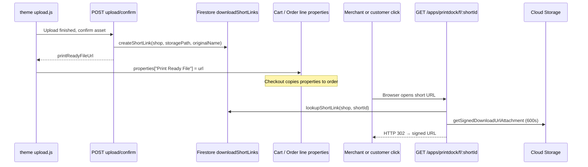

# Print Ready File — Short Link Architecture

Developer reference for how PrintDock builds **short, stable, merchant-friendly** download URLs for the `Print Ready File` line item property (v1.0.6+).

**Related docs:** `MERCHANT_FIELDS.md` (merchant-facing field dictionary), `MERCHANT_GUIDE.md` (operational overview), `STORAGE_RETENTION_AND_DELETION.md` (when files may disappear).

---

## Goals

| Goal | How we achieve it |
|------|-------------------|
| Short text in Shopify Admin | Store `https://{shop}/apps/printdock/f/{shortId}` (~60 chars), not a JWT or GCS URL |
| Clickable in order line item card | Shopify auto-linkifies `https://…` line properties |
| Links do not expire on the order | Opaque `shortId` is permanent; only the redirect target is short-lived |
| Secure downloads | App proxy auth + per-click signed GCS URL (10 min) with `Content-Disposition: attachment` |
| Files can move after order | Firestore maps session path; resolver falls back to order job path when needed |

---

## What merchants see

**Line item property**

- **Name:** `Print Ready File`
- **Value example:** `https://levyapps.myshopify.com/apps/printdock/f/AbC1d2eF34`

On the **standard** order line item card, Shopify Admin **auto-linkifies** the property value when it is a bare **`https://…` URL** (no HTML, no extra label text inside the value—the displayed `Print Ready File:` prefix is the **key**, not part of the value). The short app-proxy path keeps the hyperlink line readable.

### Constraints (same as other upload apps)

| Requirement | Reason |
|-------------|--------|
| **Value = URL only** | Shopify does not render HTML or `<a>` tags in property values (security). |
| **No text mixed into the value** | If the value accidentally included `Print Ready File: https://…`, Admin may not detect a single URL. PrintDock stores only the URL string. |
| **HTTPS** | Values are normalized to `https://…/apps/printdock/f/{id}`. |
| **No invisible characters** | Zero-width spaces / BOM can break URL detection; we trim and strip common invisible code points in the theme and in `normalizePrintReadyFileUrl` (server). |
| **Storefront host (optional)** | On confirm, the theme sends `printReadyPublicHost` (`window.location.hostname`). The server builds `https://{that-host}/apps/printdock/f/{id}` when valid (see `sanitizePrintReadyPublicHost`) so the stored URL matches how the shopper reached the store—often the **primary domain** instead of `{shop}.myshopify.com`. App proxy still resolves for any approved shop host. |

### When it still looks like “plain black text”

- **Dynamic pricing (Build A — single line):** Cart Transform `lineExpand`s the product line. **`__View uploads`** stays on the **parent** line (Admin truncated link **above** Part of). **`View uploads`**, tokens, and **`Artwork`** are on the **Part of** component via `ExpandedItem.attributes` (v1.0.11+).
- **Bundle / “Part of: …” component lines:** `View uploads` under Part of may render as plain text in some Admin layouts; use **`__View uploads`** on the parent row or **More actions → PrintDock files**.
- **Legacy two-line carts (Build B):** Older open carts may still have a separate **PrintDock Upload Fee** line until they expire; new uploads no longer add that line.
- **Verify raw data:** Query `order { lineItems { nodes { customAttributes { key value } } } }` — the `Print Ready File` **value** must be exactly the `https://` string.

**Fallbacks (optional):** **More actions → PrintDock files** (app action) uses the same URL as a button; checkout/thank-you extensions can add explicit links where Admin does not.

Each click still goes through Shopify’s app proxy to PrintDock, then **302** to Google Cloud Storage for the file download.

---

## End-to-end flow



### Phase 1 — Create mapping (upload confirm)

When an upload is confirmed and not blocked:

1. `app/routes/api.proxy.upload.confirm.tsx` calls `createShortLink(shopDomain, storagePath, originalName)`.
2. `app/services/short-link.server.ts` generates a **10-character base62** id (collision retry, max 5 attempts).
3. Firestore document is written at  
   `shops/{shopDomain}/downloadShortLinks/{shortId}`  
   with `{ storagePath, originalName, createdAt }`.
4. Public URL is returned:  
   `buildShortLinkPublicUrl(shopDomain, shortId)` →  
   `https://{shopDomain}/apps/printdock/f/{shortId}`.
5. JSON response includes `printReadyFileUrl` for the theme.

If short-link creation throws, confirm still succeeds but `printReadyFileUrl` is omitted (check logs for `upload_confirm_short_link_failed`).

### Phase 2 — Attach to cart line (theme)

`extensions/theme-extension/assets/upload.js`:

1. On successful confirm, stores `fileEntry.printReadyFileUrl` from the API response.
2. `getCartProperties()` sets `View uploads` and `__View uploads` to the first successful file’s short URL (with `_uc_session`, `Artwork`, and optional `_pd_part_of_title`).
3. Add-to-cart sends these as **line item properties**; they persist on the order.

### Phase 3 — Resolve on click (app proxy)

`app/routes/f.$shortId.tsx` handles **GET** requests proxied from the storefront:

1. `authenticate.public.appProxy(request)` — validates Shopify app-proxy signature and resolves `session.shop`.
2. Validates `shortId` shape (`isValidShortIdShape`: 4–32 alphanumeric).
3. `lookupShortLink(shopDomain, shortId)` loads Firestore mapping.
4. Ensures `storagePath` starts with `uploads/{shopDomain}/` (403 otherwise).
5. If object missing at mapped path, `findJobByLegacySessionUploadPath` may point to the post-order copy under `uploads/.../orders/{orderId}/...`.
6. `getSignedDownloadUrlAttachment(storagePath, downloadName, 600)` — **10-minute** signed read URL with attachment filename.
7. `redirect(signedUrl)` — browser downloads the file.

The URL printed on the order **never changes**; only the redirect target is regenerated.

---

## URL and routing

### Public URL shape

```text
https://{shopDomain}/apps/printdock/f/{shortId}
```

- `{shopDomain}` — e.g. `levyapps.myshopify.com` (myshopify.com or custom domain as configured on the shop).
- `{shortId}` — opaque, e.g. `AbC1d2eF34` (10 chars from `[A-Za-z0-9]`).

### Shopify app proxy configuration

From `shopify.app.toml`:

```toml
[app_proxy]
url = "https://<cloud-run-host>"
subpath = "printdock"
prefix = "apps"
```

Storefront path: `/apps/printdock/...` → forwarded to the Remix app.

### Remix route

| File | Role |
|------|------|
| `app/routes/f.$shortId.tsx` | Loader for `/f/:shortId` (proxied as `/apps/printdock/f/:shortId`) |

After `shopify app deploy` or proxy URL changes, merchants may need a **reinstall** if `/apps/printdock/...` returns 404 (see troubleshooting in `MERCHANT_FIELDS.md`).

---

## Code map

| Component | Path |
|-----------|------|
| Short ID generation + Firestore CRUD + URL builder | `app/services/short-link.server.ts` |
| Create link on confirm | `app/routes/api.proxy.upload.confirm.tsx` |
| Proxy redirect handler | `app/routes/f.$shortId.tsx` |
| GCS signed URL (attachment, TTL) | `app/services/storage.server.ts` → `getSignedDownloadUrlAttachment` |
| Post-order path fallback | `app/services/shop-data.server.ts` → `findJobByLegacySessionUploadPath` |
| Theme: store URL + line property | `extensions/theme-extension/assets/upload.js` |
| Admin: read same property for downloads | `extensions/printdock-order-files/src/ActionExtension.jsx` |
| App proxy config | `shopify.app.toml` `[app_proxy]` |

---

## Firestore schema

**Collection path**

```text
shops/{shopDomain}/downloadShortLinks/{shortId}
```

**Document fields**

| Field | Type | Purpose |
|-------|------|---------|
| `storagePath` | string | GCS object path at confirm time, e.g. `uploads/{shop}/sessions/{session}/...` |
| `originalName` | string | Filename for `Content-Disposition` (max 256 chars stored) |
| `createdAt` | timestamp | Audit |

**Short ID generation**

- Length: 10 (default)
- Alphabet: base62 `A–Z`, `a–z`, `0–9`
- Uniqueness: read-before-write per shop; retry on collision

---

## Security model

1. **Order metadata is not a secret** — anyone with the order URL or line property can attempt download. Treat like a capability URL.
2. **App proxy** — Shopify signs proxy requests; the app rejects unauthenticated proxy traffic.
3. **Shop scoping** — Lookup is always under `session.shop` from the proxy; cross-shop id guessing does not leak other shops’ files.
4. **Path prefix check** — Resolved `storagePath` must live under `uploads/{shopDomain}/`.
5. **Short-lived GCS URLs** — Signed URLs expire in **600 seconds**; not stored on the order.
6. **No JWT in line properties (v1.0.6+)** — avoids 7-day token expiry and multi-kilobyte property values.

---

## Order lifecycle and file moves

On `orders/create`, the webhook may **copy** the asset from the session upload path to `uploads/{shop}/orders/{orderId}/{renamedFile}`.

The short link record still points at the **original** `storagePath` from confirm time. The download handler:

1. Tries `fileExists(storagePath)` on the mapped path.
2. If missing, resolves via `findJobByLegacySessionUploadPath` to the order job’s `assetSnapshot.storagePath`.
3. Session uploads are **not deleted** on order create specifically so legacy token links keep working; short links benefit from the same fallback.

See `app/routes/webhooks.orders.create.tsx` comments near asset rename/copy.

---

## Legacy format (pre–v1.0.6)

| Aspect | Legacy | Current |
|--------|--------|---------|
| Property value | Long `…/apps/printdock/api/proxy/upload/file?token=<JWT>` | `…/apps/printdock/f/<shortId>` |
| Token in order | Yes (~7 day JWT in URL) | No |
| Handler | `app/routes/api.proxy.upload.file.tsx` | `app/routes/f.$shortId.tsx` |

The legacy route remains deployed so old orders keep working until embedded tokens expire.

---

## Admin UI extension (secondary entry)

**More actions → PrintDock files** (`extensions/printdock-order-files`) reads `View uploads`, `__View uploads`, and legacy `Print Ready File` custom attributes and opens the same short URLs in a download modal.

---

## Troubleshooting

| Symptom | Likely cause | What to check |
|---------|----------------|---------------|
| No `Print Ready File` on line | Confirm failed, blocked upload, or short-link error | Theme upload status; log `upload_confirm_short_link_failed` |
| 404 on click | Short id missing in Firestore or file deleted | Firestore doc; GCS object; retention policy |
| 404 after order | Copy path mismatch | Job `assetSnapshot.storagePath`; fallback in `f.$shortId.tsx` |
| 401/403 on click | App proxy not configured or wrong shop | `shopify.app.toml`, reinstall, dev proxy URL |
| Link shows but download wrong name | `originalName` at confirm time | Firestore `originalName` field |
| Property is very long URL with `token=` | Old order (pre-1.0.6) | Expected; legacy route handles until JWT expires |

**Log events**

- `short_link_download_requested` — proxy hit with `shortId`
- `upload_confirm_short_link_failed` — mapping not created at confirm
- `upload_file_download_requested` — legacy token route

---

## Checklist: implementing or changing this pattern

Use this when adding a new download surface or debugging regressions:

- [ ] Confirm creates Firestore mapping **before** returning URL to theme.
- [ ] Public URL uses `buildShortLinkPublicUrl` (shop domain + `/apps/printdock/f/`).
- [ ] Theme writes **`View uploads`** and **`__View uploads`** when `printReadyFileUrl` is non-null (v1.0.9+).
- [ ] App proxy `subpath` / `prefix` match deployed `shopify.app.toml`.
- [ ] Remix route exists for `/f/:shortId` and uses `authenticate.public.appProxy`.
- [ ] Redirect uses `getSignedDownloadUrlAttachment`, not a long-lived public GCS URL on the order.
- [ ] Post-order copy path covered by `findJobByLegacySessionUploadPath` if session file is moved.
- [ ] Do **not** embed GCS signed URLs or HMAC JWTs in line properties for new work.

---

## Version history

| Version | Change |
|---------|--------|
| v1.0.6 | Short links via `/apps/printdock/f/{shortId}` and `downloadShortLinks` Firestore collection |
| Pre-v1.0.6 | JWT in query string on `/api/proxy/upload/file` |

Changelog: root `CHANGELOG.md` (v1.0.6 section).
